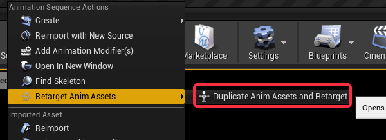

# 动画重定向

> https://docs.unrealengine.com/4.27/zh-CN/AnimatingObjects/SkeletalMeshAnimation/AnimationRetargeting/
>
> https://zhuanlan.zhihu.com/p/130948010

本文仅介绍最简单的动画重定向，用于快速支持动画资源复用。

## 环境准备

+ UE4
+ 重定向源 Source
  + 重定向源动画 SourceAnimation
+ 重定向目标 Target

这里举个例子以更好地理解上面的概念：当前有个游戏角色（Target）缺少动画，我们希望利用在商城中下载的小白人（Source）动画资源，通过重定向复用到游戏角色中。在这样一个使用环境中，我们称存在动画资源的小白人为**Source**，称缺少动画资源的游戏角色为**Target**。

## 基本步骤

**目的：**通过重定向的操作，会得到一份新的动画文件，这份动画文件能够直接套用到Target上。换句话说，也就是利用源动画来生产新动画。

要重定向动画，需要包含以下四个步骤

1. 准备Source、SourceAnimation
2. 调整Source骨骼树
3. 重定向动画资源
4. 调整Target骨骼树

### 准备Source、SourceAnimation

从商城中下载资源或者通过[Migration](https://docs.unrealengine.com/4.26/zh-CN/Basics/AssetsAndPackages/Migrate/)功能从其它仓库迁移资源到项目工程中。

这一步没有什么要求，但是最好能够将所有Source相关资源放在同一目录下，目录无规则，仅为了在重定向得到新的动画文件后便于方便清理源文件（重定向得到的动画不依赖Source中任何内容，可放心删除）。

### 调整Source骨骼树

这一步十分关键！

重定向功能要求**Source的重定向骨骼**和**Target的重定向骨骼**对齐，由于我们不允许去修改**Target的重定向骨骼**（涉及到项目内资源复用问题，不可能为了一个动画去修改项目资源），因此这一步我们需要将**Source的重定向骨骼**对其**Target的重定向骨骼**。

（其实这里对重定向骨骼的更准确描述是重定向Reference Pose或者重定向Binding Pose，以下纠结于这其中的区别）

调整重定向骨骼包含以下步骤：

1. 打开Source的骨骼编辑器（双击Source Skeleton文件），并点击Retarget Manager，可以得到以下界面

   

2. 在Select Rig中选择Humanoid，并点击View Pose按钮

   

3. 对照着Target骨骼的姿态，直接在界面上调整Source骨骼位置（或者利用Skeleton Tree选择特定的骨骼），以下提供两个小提示

   1. 修改显示模式为Wireframe，然后Bone Drawing选择All Hierarchy，可以看到所有的骨骼，更方便调整

      

   2. 一定要确定从不同角度观察角色，保证Source和Target的姿态是几乎一致的，不能仅仅是大致相似，特别是小白人的手部关节的弯曲程度。

4. 调整完骨骼后点击Modify Pose，选择Use Current Pose。可以通过切换Hide Pose和View Pose确定是否修改成功（点击View Pose是显示重定向骨骼，Hide Pose是原来的Reference Pose）

   

   

### 重定向动画资源

通过上面步骤我们已经得到了可以重定向的骨骼，现在所有Source Animation都可以直接应用于Target上了。

1. 选择一个希望重定向的Source资源，右键选择其中的Duplicate Anim Assets and Retarget

   

2. 在弹出的界面中中选择Target的骨骼，直接点击Retarget，就能得到一份新的动画文件（直接出现在Content根目录下）

### 调整Target骨骼树

预览得到的动画文件，可以发现现在的动画数据还是不正确的，这时候需要对骨骼树进行一些处理。

1. 选择骨骼树，并勾选 Show Retargeting Options

   

2. 在下面的会多出一列Translation Retarget，在这一步需要对选项进行选择。

3. 这里可以先右键选择Spine，然后选择Recursively Set Translation Retargeting Skeleton，会将Spine下面的子骨骼Translation Retarget类型全部改为Skeleton。到这一步基本就差不多可以看了，但如果还要更准确的调整，可以继续参考以下对每种类型解释的补充，针对性的调整。

   

由于上面这一步是直接调整的Target骨骼信息，因此如果还需要重定向其它的Source Animation资源，可以直接进行【重定向动画资源】操作，无须再执行Target骨骼树的调整。如果需要SVN提交，直接提交重定向后的动画资源即可。

## 补充

以下为重定向知识的补充，与重定向操作本身无关。

### 基本原理

重定向的基本原理就是利用Source和Target通过一个通用的中间骨骼进行联系起来，动画通过Source和Target骨骼之间的差异对Translation数据进行变化和调整。

### 选择Humanoid与View Pose

简单介绍一下以上两个操作的意义

+ 在Select Rig这里选择的就是中间骨骼的格式，Humanoid是常用的人形骨骼格式，包含Root \ Pelvis（盆骨） \ Arm（手臂） \ Hand（手掌） ，小白人和项目中的角色都是人型骨骼，因此选择Humanoid（没研究过不同格式之间转换会怎样....）
+ 有时候甚至需要对Select Rig下面的列表（ Souce -> Target）进行修改，保证Source 、Target和标准的Humanoid之间的映射是正确的。例如：有一些很畸形的骨骼，可能不存在spine01->spine02->spine03这样的结构，而是直接spine->spline03，这时候就需要将spine02设置为None，表示其在当前骨骼中不存在
+ 这里一定要点View Pose，不然看到的就是原来的Reference Pose（T-Pose or A-Pose），而不是重定向骨骼（更准确来说是重定向Reference Pose）

### Translation Retarget选项

其中包含五个选项

[官方定义](https://docs.unrealengine.com/4.27/zh-CN/AnimatingObjects/SkeletalMeshAnimation/AnimationRetargeting/)

> - **Animation（动画）**——骨骼平移来自动画数据，不做改变。
> - **Skeleton（骨架）**——骨骼平移来自目标骨架的绑定姿势。
> - **比例动画（AnimationScaled）**——骨骼平移来自动画数据，但按骨架的比例调整。这是目标骨架（播放动画的骨架）与源骨架（制作动画的骨架）的骨骼长度之比。

[UE4中的动画系统新功能](https://www.bilibili.com/video/BV174411M79Q?p=7) 20:30开始对除了Animation Relative的另外四项做出解释。在此以Source为瘦子，Target为胖子举例，基本可以概括如下：

+ Animation：直接利用动画数据，Target胖子利用了这份重定向动画后会变成瘦子
+ Skeletion：还是胖子，平移数据取决于胖子的骨架，换句话说，只用了动画的旋转信息
+ Animation Scaled：利用胖子和瘦子的骨架差异，计算出相应地Translation
+ Orient and Scale：除了计算Translation，还计算了Rotation的差异

对于Animation Relative，与Animation Scaled类似，Scaled计算的是ReferencePose之间的商，而Relative直接计算的ReferencePose的差。

具体算法可以参考 AnimationRuntime.cpp::RetargetBoneTransform，代码非常直观简单

