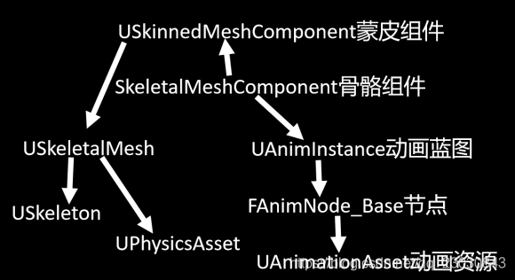
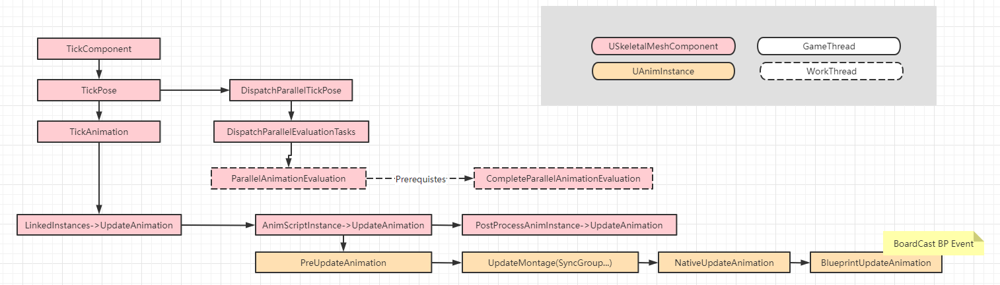

# 动画系统概述

## 动画类型

+ Morph动画（顶点动画）：直接指定动画每一帧的顶点位置，其动画关键中存储的是Mesh所有顶点在关键帧对应时刻的位置（vat，spine）
+ 关节动画：将模型分为很多个mesh，mesh之间通过变换矩阵建立父子关系（机器人）
+ 骨骼蒙皮动画（SkinnedMesh）：解决关节动画的裂缝问题。骨骼由动画数据驱动，mesh上的顶点利用骨骼信息确定最终位置。

## 工作流

骨骼动画系统工作流如下：

1. 创造美术资源：3ds Max / Maya
2. 导入UE4，生成.uasset：Skeleton、Animation
3. 处理角色与蓝图动画
   + 玩家输入：PlayerController / BP 
   + Pawn解析输入并控制玩家移动
   + 结合角色蓝图，构造动画蓝图，其中Event Graph利用Pawn的数据驱动

## 动画基础概念对照（with Messiah)

与Messiah中的动画概念相对照，不完全相同，但可以从Messiah中类似的概念中找到二者相似之处，有助于理解UE4中的概念。


[动画蓝图](https://docs.unrealengine.com/4.27/zh-CN/AnimatingObjects/SkeletalMeshAnimation/AnimBlueprints/) AnimBlueprint

​	[动画图表](https://docs.unrealengine.com/4.27/zh-CN/AnimatingObjects/SkeletalMeshAnimation/AnimBlueprints/AnimGraph/) AnimGraph -> Graph

​	[事件图表](https://docs.unrealengine.com/4.27/zh-CN/AnimatingObjects/SkeletalMeshAnimation/AnimBlueprints/EventGraph/) EventGraph -> Event + Python

角色蓝图 BP -> Python

[动画序列](https://docs.unrealengine.com/4.27/zh-CN/AnimatingObjects/SkeletalMeshAnimation/Sequences/) AnimSequence -> ActionNode

[动画蒙太奇](https://docs.unrealengine.com/4.27/zh-CN/AnimatingObjects/SkeletalMeshAnimation/AnimMontage/Overview/) AnimMontage -> Timeline

[动画通知](https://docs.unrealengine.com/4.27/zh-CN/AnimatingObjects/SkeletalMeshAnimation/Sequences/Notifies/) AnimNotifies -> Cue

[根运动](https://docs.unrealengine.com/4.27/zh-CN/AnimatingObjects/SkeletalMeshAnimation/RootMotion/) Root Motion -> Motion Node

[虚拟骨骼](https://docs.unrealengine.com/4.27/zh-CN/AnimatingObjects/SkeletalMeshAnimation/Persona/VirtualBones/) Virtual Bones -> HP_xxx

[Curve](https://docs.unrealengine.com/4.27/zh-CN/AnimatingObjects/SkeletalMeshAnimation/Sequences/Curves/) -> 无

Pose -> Pose

[过场动画编辑器](https://docs.unrealengine.com/4.27/zh-CN/AnimatingObjects/Sequencer/) Sequencer -> Montage


关于AnimSequence、Animation、Pose做个区分：

+ AnimSequence：用于播放Animation的载体，另外包括压缩模式，Notify等额外的信息。
+ Animation：单纯的动画数据
+ Pose：本身与Animation之间没有关系，但可以将Pose理解为一个固定的骨骼数据，如动画某一帧的骨骼数据、通过AnimGraph计算出来的骨骼数据、在蒙皮中用于参考的骨骼信息（T-Pose、A-Pose）

## 动画基本数据结构



### Skeleton

主要记录骨骼的信息：

+ 骨骼层级信息
+ 参考姿势信息（T-Pose...）
+ 骨骼名称
+ Socket信息
+ Animation Notify
+ Slot信息
+ Virtual Bones
+ 骨骼名称Index映射表
+ 重定向信息
+ LOD设置信息

### SkeletalMesh

蒙皮mesh

+ 模型几何信息
+ 顶点蒙皮权重
+ 重定向资源
+ 模型LOD、材质信息
+ 所属骨架
+ Morph Target信息
+ Physics Asset
+ Cloth

### Animation Instance

这是我们最需要关心的地方，是所有动画逻辑的控制中心，详细内容会在下文动画逻辑中描述。

### Animation Sequence

Animation Sequence继承于Animation Asset，以此举例，包含了以下内容

+ 动画关键帧信息
+ Root Motion
+ 动画Notify信息
+ 动画Curve信息
+ 叠加动画设置


值得一提的：Animation，SkeletalMesh，PhysicsAsset等都是基于一个Skeleton的

## 动画逻辑

主要可以分为三个阶段：

+ Initialize：初始化数据
+ Tick
  + Update：准备所需要的信息（单线程）
  + Evaluate：具体计算每个节点和动画内容（多线程）
  + Complete：将运算后的顶点数据推送到渲染现场，更新物体位置和动画通知
+ Uninitialize：清理掉所有资源

### Initialize

USkeletalMeshComponent::InitAnim

1. ClearAnimScriptInstance：清理数据
2. RecalcRequiredBones：根据LOD计算所需要的骨骼
3. InitializeAnimScriptInstance：创建动画蓝图
4. TickAnimation：初始化所需要的数据，主要是curve
5. RefreshBoneTransforms：更新Bone

### Tick



流程图如上，执行Update的地方在 `USkeletalMeshComponent::TickComponent`。

#### `USkeletalMeshComponent` 和 `AnimationInstance`

由上面流程图可以大致看出`TickComponent`的执行流程（流程图中忽略了部分不太重要的内容），其中包括两个重要的对象`USkeletalMeshComponent`和 `AnimationInstance`。

`SkeletalMeshComponent`是承担了骨骼动画系统的全部责任，主要包括两部分内容 **计算骨骼Pose** 和 **蒙皮**。

`AnimationInstance`由`SkeletalMeshComponent`创建，是负责计算`Pose`的主要对象，并且`AnimationBlueprint`也是基于`AnimationInstance`的。当`SkeletalMeshComponent`进行Tick时，会调用`AnimationInstance`中的`ParallelUpdateAnimation()`方法，这个方法会调用所有蓝图节点的`Update_AnyThread`方法，更新所有节点状态。


`TickComponent`中主要包括`TickPose`和`DispatchParallelTickPose`两个过程。下面简单的对这两个方法进行展开描述。

#### `TickPose` 

主要工作是`Update`一些信息，与命名不同，并不进行实际的Pose处理。

`TickPose`中最重要的调用为`TickAnimation`，而`TickAnimation`中包含了三步，分别对 所有LinkedInstance、当前AnimationInstance、PostProcess-AnimationInstance执行UpdateAnimation。其中LinkedInstance可参考[Using Animation Blueprint Linking](https://docs.unrealengine.com/4.27/en-US/AnimatingObjects/SkeletalMeshAnimation/AnimHowTo/LinkedAnimBP/)文档，PostProcess-AnimationInstance可参考[Animation Blueprints](https://docs.unrealengine.com/4.27/en-US/AnimatingObjects/SkeletalMeshAnimation/AnimBlueprints/)中的*Assigning Post Process Animation Blueprints*章节。下面列举`UpdateAnimation`的主要功能： 

+ PreUpdateAnimation：检查是否需要切换LOD，处理同步组内容，存储信息，调用Node->PreUpdate方法等...
+ UpdateMontage(...)：更新Montage相关的内容：同步信息、Section选择、提取Root Motion等..
+ NavtiveUpdateAnimation：提供用来override的方法，可以在这个位置收集动画信息
+ BlueprintUpdateAnimation：回调蓝图Event

网络上很多资料都会提及UpdateAnimation是更新节点状态，或者更新Pose信息的位置，没有去细究其中的原因，可能是版本原因，但在4.27中，这些真正执行更新的地方在`DispatchParallelTickPose`中，`TickPose`中的`Update`只进行一些基本信息的提取。

#### `DispatchParallelTickPose`

根据函数名知道这个调用一定会涉及到多线程的内容，在介绍具体内容的前，首先需要了解UE4的线程划分和一个重要的结构体`FAnimInstanceProxy`。

##### 线程划分

UE中包含四种类型的线程：

+ Game Thread
+ Render Thread
+ Task Based Multi-Threading
+ Worker Thread

具体内容可以参考[Concurrency & Parallelism in UE4](https://nanopdf.com/download/gerke-max-preussner-4_pdf)这份ppt。

在这里只需要关注Game Thread和Worker Thread即可。Game Thread就是通常而言的主线程，负责所有的游戏，蓝图，UI等逻辑。而Worker Thread则负责处理所有需要临时计算，正如其名，是个来活就干的打工仔。由于动画的更新不依赖顺序，相互之间也不会产生交集，正好可以利用这类线程来做并行。

##### `FAnimInstanceProxy`

虽然动画之间不会产生交集，可以利用并行计算，但计算过程中却需要利用AnimationInstance上的数据。不幸的是，有一些锁定封锁器会阻止对AnimationInstance的访问。用最直观的方法，可以等待封锁器解锁再进行内容写入，但这种效率太低了，为了高效地解决这个问题，产生了`FAnimInstanceProxy`。

AnimInstanceProxy，顾名思义，是真正AnimInstance的代理，仅仅与AnimInstance进行了数据交换（通过缓冲、复制或其他策略），接下来所有数据访问都可以通过AnimInstanceProxy进行，这样就不会被锁定封锁器限制。

总之，将游戏逻辑得更新从UAnimInstance转移到AnimInstanceProxy,并且动画图表中只能访问AnimInstanceProxy中得数据，从而做并行优化。


了解完线程划分和AnimInstanceProxy后，接下来就来看一下`DispatchParallelTickPose`中的函数调用。

#### ParallelAnimationEvaluation

`DispatchParallelTickPose`调用了`DispatchParallelEvaluationTasks`，而`DispatchParallelEvaluationTasks`中分别对`ParallelAnimationEvaluation`和`CompleteParallelAnimationEvaluation`进行任务的分发。`ParallelAnimationEvaluation`中最重要的方法为 `FParallelAnimationEvaluationTask`，下面详细对这个方法进行阐述。

在其中执行了`PerformAnimationProcessing`方法：

```c++
void USkeletalMeshComponent::PerformAnimationProcessing(...)
{
    ...
    if(InAnimInstance && InAnimInstance->NeedsUpdate())
    {
        InAnimInstance->ParallelUpdateAnimation();
    }
    if(ShouldPostUpdatePostProcessInstance())
	{
		// If we don't have an anim instance, we may still have a post physics instance
		PostProcessAnimInstance->ParallelUpdateAnimation();
	}
    
    // evaluate pure animations, and fill up BoneSpaceTransforms
	EvaluateAnimation(InSkeletalMesh, InAnimInstance, OutRootBoneTranslation, OutCurve, EvaluatedPose, OutAttributes);
	EvaluatePostProcessMeshInstance(OutBoneSpaceTransforms, EvaluatedPose, OutCurve, InSkeletalMesh, OutRootBoneTranslation, OutAttributes);

	// Finalize the transforms from the evaluation
	FinalizePoseEvaluationResult(InSkeletalMesh, OutBoneSpaceTransforms, OutRootBoneTranslation, EvaluatedPose);

	// Fill SpaceBases from LocalAtoms
	FillComponentSpaceTransforms(InSkeletalMesh, OutBoneSpaceTransforms, OutSpaceBases);
}
```

下面以`ParallelUpdateAnimation`为例子展开阐述，其它内容相似。

##### ParallelUpdateAnimation

```c++
void UAnimInstance::ParallelUpdateAnimation()
{
    GetProxyOnAnyThread<FAnimInstanceProxy>().UpdateAnimation();
    ...
    GetProxyOnAnyThread<FAnimInstanceProxy>().TickAssetPlayerInstances();
}
```

这里出现了前文提到的`FAnimInstanceProxy`，所有的并行任务都必须通过`AnimInstanceProxy`进行处理，不应该直接和AnimInstance进行交互。

在`Proxy.UpdateAnimation`会调用`UpdateAnimation_WithRoot`，其中会包含以下三个操作：

1. 调用所有的节点`CacheBones_AnyThread`（通常用于LOD切换时候保留骨骼用）
2. 调用用于override的`Update`函数
3. 调用所有节点的`Update_AnyThread`

`Proxy.TickAssetPlayerInstances`中则处理了同步组和RootMotion的内容，不是很重要，可以先跳过。

##### 其它

+ `EvaluateAnimation`与`ParallelUpdateAnimation`相似，调用了所有节点的`Evaluate_AnyThread`方法
+ 对于`PostProcessAnimInstance`，执行一次`EvaluateAnimation`
+ `FinalizePoseEvaluationResult`：整理骨骼数据
+ `FillComponentSpaceTransforms`：将所有骨骼数据转换到Component Space上
  + Local Space：局部空间，以父节点为根
  + Component Space：模型空间，以Component为根
  + World Space：世界空间，以原点为根


剩下的内容就是Proxy和真正的AnimInstance交换数据，分发Notify，后处理，混入物理动画，再填充到蒙皮所需要的buffer上。


## 后记

动画系统还剩下许多内容未设计到，后面慢慢展开，包括：

+ 动画节点详解：[ref1](https://docs.unrealengine.com/4.27/zh-CN/AnimatingObjects/SkeletalMeshAnimation/AnimHowTo/)，[ref2](https://zhuanlan.zhihu.com/p/62401630)
+ 动画节点的写法：[ref1](https://docs.unrealengine.com/4.27/zh-CN/AnimatingObjects/AnimationNodeTechnicalGuide/)， [ref2](https://unrealcommunity.wiki/animation-node-translate-with-complete-source-code-and-instructions-mty4zao9)
+ [骨骼的渲染](https://papalqi.cn/ue4%E5%8A%A8%E7%94%BB%E7%B3%BB%E7%BB%9F%E6%BA%90%E7%A0%81%E5%89%96%E6%9E%90/#31%E6%95%B0%E6%8D%AE%E5%92%8C%E6%B5%81%E7%A8%8B)：涉及蒙皮算法，渲染数据更新与传递
+ [基于物理的动画](https://docs.unrealengine.com/4.27/zh-CN/AnimatingObjects/SkeletalMeshAnimation/PhysicallyDrivenAnimation/)
+ [Sequencer的使用](https://docs.unrealengine.com/4.27/zh-CN/AnimatingObjects/Sequencer/)
+ [Paper2D（sprite）](https://docs.unrealengine.com/4.27/zh-CN/AnimatingObjects/Paper2D/)

