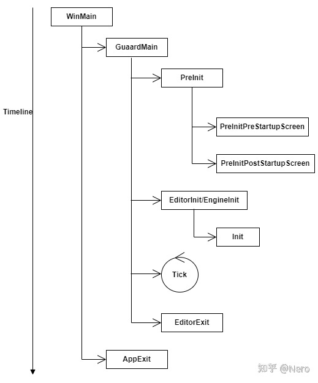

# Tick的三种方式

>https://zhuanlan.zhihu.com/p/477018560

## 太长不看

+ 添加普通定时器（Add Timer）：直接用`GetTimerManager().SetTimer`，把Handle存下来（用于Clear），[示例](###TimeManager示例)
+ 需要每帧Tick的对象（XXXManager）：继承` FTickableGameObject`，重写`Tick`方法，[示例](##TickableGameObject)
+ 复杂需要处理依赖的Tick —— TickFunction：理解UE多线程那一套，并且撰写一些必要逻辑，[示例](###TickFunction示例)

## 简介

本文讨论的内容主要关于如何在主线程中合理、正确地添加计时器，不涉及引擎本身提供的update逻辑以及多线程内容。

首先来看一下UE主线程的生命周期图。



不难理解，所有的Tick相关的内容都应该存在于图中的【Tick】中，而【Tick】会去调用`World::Tick`方法，所有Tick相关的内容都会由`World::Tick`调用，想要搞清楚UE中Tick相关的内容，首先需要大致浏览这个函数。

## World::Tick

```c++
void UWorld::Tick( ELevelTick TickType, float DeltaSeconds )
{
    BroadcastTickDispatch(DeltaSeconds);
	BroadcastPostTickDispatch();
    if( NetDriver && NetDriver->ServerConnection )
	{
		TickNetClient( DeltaSeconds );
	}
    
    RunTickGroup(TG_PrePhysics);
    RunTickGroup(TG_StartPhysics);
    ...
    RunTickGroup(TG_PostPhysics);
    
    GetTimerManager().Tick(DeltaSeconds);
    FTickableGameObject::TickObjects(this, TickType, bIsPaused, DeltaSeconds);
    
    RunTickGroup(TG_PostUpdateWork);
    RunTickGroup(TG_LastDemotable);
}
```

以上省略了大部分与Tick不相关的内容，从代码中大致可以区分出四种不同类型的Tick实现方式：

1. 绑定特定事件，在Broadcast中回调
2. RunTickGroup
3. TimeManager
4. TickableGameObject

对于第一种方式，主要是与网络相关的逻辑处理，在此可以暂时忽略（但也提醒了我们一种增加Tick的方式，也就是直接在World::Tick中新增一个特殊Event直接Binding，但不推荐）。下面我们主要分析另外三种Tick的方式。

RunTickGroup相对来说比较复杂，我们留到最后来说。由浅至深，先来讨论一下TickableGameObject的用法

## TickableGameObject

这种方式很简单，在构造函数中将当前对象（this）加入到全局的队列中，然后在`World::Tick`中取出队列中的对象进行Tick调用。用法比较简单，例如：

```c++
class AIMODULE_API UAISubsystem : public UObject, public FTickableGameObject
{
    virtual void Tick(float DeltaTime) override {}
}
```

可以看到，这种方式的使用场景在于需要每帧执行Tick方法的对象使用，特别适合一些Manager\System类型的对象使用。

## TimeManager

不同于TickableGameObject是将标记直接作用在对象（或者说类上），通常我们的使用场景只是想新增一个普通的定时器，那TimeManager就提供了这种场景下的解决方案。

来看一下TimeManager为我们提供了什么方法可用于定时器的添加：

```c++
class ENGINE_API FTimerManager : public FNoncopyable
{
    void SetTimer(FTimerHandle& InOutHandle, ...);
    FTimerHandle SetTimerForNextTick(...);
    void ClearTimer(FTimerHandle& InOutHandl);
    void ClearAllTimersForObject(void const* Object);
    void PauseTimer(FTimerHandle InHandle);
    void UnPauseTimer(FTimerHandle InHandle);
    ...
    FTimerHandle GenerateHandle(int32 Index);
    FTimerData* FindTimer( FTimerHandle const& InHandle );
}
```

TimeManager提供的方法非常直观，直接看以上定义即可，但这里需要注意两个类型TimerHandle和TimerData。

+ TimerHandle：是TimeManager为新增定时器后返回的Handle，调用方如果想取得该定时器，需要利用Handle进行查询

+ TimerData：具体的定时器数据保存在TimerData中，Tick中处理的内容也是TimerData

看一下简单的使用示例：

### TimeManager示例

```c++
class FSimpleTimer
{
private:
    TMap<int, FTimerHandle> Timers;
    int Timerindex;
public:
    int SetTimer(const TFunction<void(float)>& Callback, float Interval, bool bIsLoop)
    {
        FTimerDelegate TimerDelegate;
    	TimerDelegate.BindLambda([=](const TFunction<void(float)>& func) {
            if (func != nullptr)
            {
                func(Interval);
            }
        }, Callback);
        FTimerHandle Handler;
        GetTimerManager().SetTimer(Handler, TimerDelegate, Interval, bIsLoop);
        ++Timerindex;
        Timers.Add(Timerindex, Handler);
        return Timerindex;
    }
 
    void FTimerMgr::RemoveTimer(int Index)
    {
        if (!Timers.Contains(Index))
        	return;
        FTimerHandle Handler = Timers[Index];
        Timers.Remove(Index);
        GetTimerManager().ClearTimer(Handler);
    }
}
```

这种方式的使用场景是使用普通定时器进行逻辑处理，直接利用` GetTimerManager().SetTimer`新增即可。

值得一提的是TimeManager内部是利用Heap实现的，减少了Timer的遍历。

## RunTickGroup

最后是`RunTickGroup`，首先看一下这个函数的定义。

```c++
void UWorld::RunTickGroup(ETickingGroup Group, bool bBlockTillComplete = true)
{
	check(TickGroup == Group);
	FTickTaskManagerInterface::Get().RunTickGroup(Group, bBlockTillComplete);
	TickGroup = ETickingGroup(TickGroup + 1); 
}
```

`RunTickGroup`将逻辑处理转发给`FTickTaskManagerInterface::Get().RunTickGroup`，其他为校验内容，可以直接忽略。

```c++
virtual void RunTickGroup(ETickingGroup Group, bool bBlockTillComplete ) override
{
    TickTaskSequencer.ReleaseTickGroup(Group, bBlockTillComplete);
    if (bBlockTillComplete)
    {
        ...
        LevelList[LevelIndex]->QueueNewlySpawned(Context.TickGroup);
        ...
    }
}
```

在ReleaseTickGroup中会执行所有当前Group中的Tick任务，由于在执行Tick的过程中可能存在新的Tick任务添加，因此还需要处理新加入的Tick任务。

具体ReleaseTickGroup中对Tick的任务执行涉及到TaskGraph的知识，想要理解其中的内容首先需要了解多线程的内容。略去复杂内容，总结可以得出结论：最终会调用传入的TickFunction中的`ExecuteTick`方法。在此，TickFunction的定义和使用至关重要，下面以我们最熟悉的Actor作为实例进行分析帮助理解：

回想一下我们想让Actor保持Tick会怎么写

```c++
ASimpleActor::ASimpleActor()
{
    PrimaryActorTick.bCanEverTick = True;
    ...
}

class ENGINE_API AActor : public UObject
{
    ...
    struct FActorTickFunction PrimaryActorTick;
    ...
}
```

我们修改了`PrimaryActorTick中`的`bCanEverTick`，而其类型`FActorTickFunction `正是继承于`FTickFunction`，下面来看`FActorTickFunction`

```c++
struct FActorTickFunction : public FTickFunction
{
	GENERATED_USTRUCT_BODY()

	class AActor* Target;
    ENGINE_API virtual void ExecuteTick(float DeltaTime, ELevelTick TickType, ENamedThreads::Type CurrentThread, const FGraphEventRef& MyCompletionGraphEvent) override
    {
        Target->TickActor(DeltaTime*Target->CustomTimeDilation, TickType, *this);
    }
    ...
}

template<>
struct TStructOpsTypeTraits<FActorTickFunction> : public TStructOpsTypeTraitsBase2<FActorTickFunction>
{
	enum
	{
		WithCopy = false
	};
};

class ENGINE_API AActor : public UObject
{
	...
    void AActor::TickActor( float DeltaSeconds, ELevelTick TickType, FActorTickFunction& ThisTickFunction )
    {
        if (!IsPendingKill() && GetWorld())
        {
            Tick(DeltaSeconds);	
        }
    }
}

```

可以看到，ActorTickFunction会调用`Actor::Tick`。有了调用的位置，接下来就需要搞清楚如何注册的：

注册的方式也很直白，在Actor::BeginPlay中，会根据`bCanEverTick`决定是否调用`RegisterAllActorTickFunctions`，然后PrimaryActorTick会调用`RegisterTickFunction`将TickFunction加入到TickTaskManager中

### TickFunction示例

总而言之，要使用TickFunction，需要完成以下三件事：

1. 继承TickFunction，并重写ExecuteTick
2. 写出TStructOpsTypeTraits
3. 调用TickFunction的`SetTickFunctionEnable`和`RegisterTickFunction`，修改bCanEverTick = true

这种方式相较于前两种更为复杂，是因为TickFunction的诞生是用于处理依赖关系的（可以在Actor中看到类似`AddPrerequisite`之类的方法，用于处理Actor之间调用的依赖关系），并且，TickFunction还提供标记用于在几个不同阶段进行调用。因此，对于更复杂的Tick内容，我们应该使用TickFunction的解决方案。

另外，TickFunction利用TaskGraph的多线程性质（或者说TaskGraph就是为了处理TickFunction，相辅相成），相较于前面两种Tick方式，更适合处理并行的问题。但不适合处理计算量大的问题，详情可见多线程一文解释。

## 小结

+ TickableGameObject：适合不断进行Tick，并且没有依赖关系的对象，通常为各部分系统Manager、System之类的管理类
+ TimeManager：最常用的定时器实现
+ RunTickGroup：当处理较为复杂的依赖和时序逻辑时可使用

