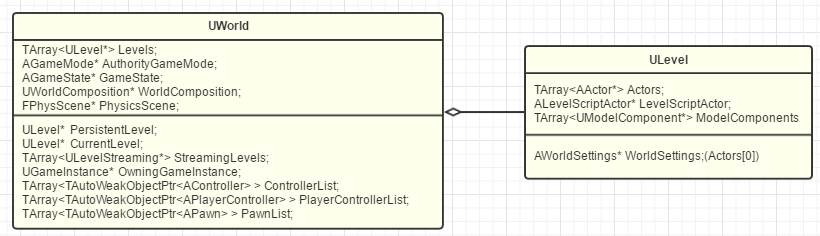
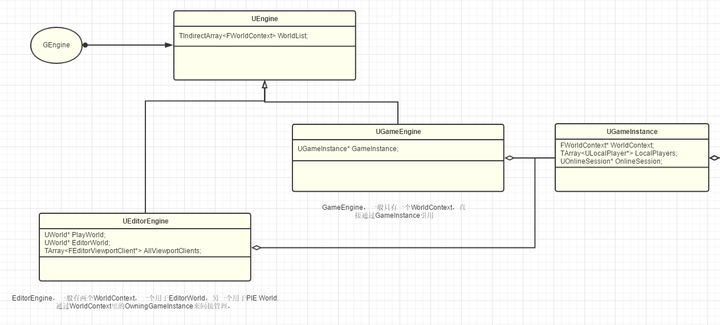

# [InsideUE4（知乎 ( *by 大钊* ) ）](https://zhuanlan.zhihu.com/p/22813908)

## GamePlay架构

### [GamePlay架构（一）Actor和Component](http://zhuanlan.zhihu.com/p/22833151)

#### UObject


#### Actor


#### Component


### [GamePlay架构（二）Level和World](http://zhuanlan.zhihu.com/p/22924838)

#### Level


#### World



包含一个主Level，在UE4中叫做Persistent Level

### [GamePlay架构（三）WorldContext，GameInstance，Engine](https://zhuanlan.zhihu.com/p/23167068)

#### WorldContext

UE用来管理和跟踪这些World的工具就是WorldContext


#### GameInstance

GameInstance里会保存着当前的WorldConext和其他整个游戏的信息


#### Engine




理清Gameplay自底而上的结构Object->Actor+Component->Level->World->WorldContext->GameInstance->Engine。对每一个类型职责以及相互关系有有初步的了解即可。

### [GamePlay架构（四）Pawn](https://zhuanlan.zhihu.com/p/23321666)

#### Component

+ Component表达的是“功能”的概念
+ ·正确理解“功能”和“游戏业务逻辑”的区分是理解Component的关键要点
+ 一旦你发现你在Component中含有游戏的业务逻辑代码，这就是所谓的“Bad Smell”了

#### Pawn

1. 可被Controller控制（可以响应输入和处理逻辑）
2. PhysicsCollision表示（表达自身的存在）
3. MovementInput的基本响应接口（可以移动）

#### DefaultPawn / SpectatorPawn / Character

Movement + Collision + Mesh


### [GamePlay架构（五）Controller](https://zhuanlan.zhihu.com/p/23480071)

#### AController

AController = AActor + 控制Pawn的能力（继承）

By default, there is a one-to-one relationship between Controllers and Pawns; 


##### 思考：哪些逻辑应该写在Controller中？

从概念来说，Pawn本身表示的是一个“能动”的概念，重点在于“能”（Pawn固有能力）。而Controller代表的是动到“哪里”的概念，重点在于“方向”（可替换逻辑、智能决策）

从对应来说，如果一个逻辑只属于某一类Pawn，那么其实你放进Pawn内也挺好。而如果一个逻辑可以应用于多个Pawn，那么放进Controller就可以组合应用了

从存在性来说， Controller的生命期比Pawn要长一些。所以对于那些需要在Pawn之外还要持续存在的逻辑和状态，放进Controller中是更好的选择。


#### APlayerState

APlayerState也理所当然是生成在Level中的，跟Pawn和Controller是平级的关系，用于存储玩家状态数据。


**思考：哪些数据应该放在PlayerState中？**

PlayerState表示的是玩家的游玩数据，所以那些关卡内的其他游戏数据就不应该放进来（GameState是个好选择），另外Controller本身运行需要的临时数据也不应该归PlayerState管理。在切换关卡的时候，APlayerState也会被释放掉，所有PlayerState实际上表达的是当前关卡的玩家得分等数据。（单局需要持久化的玩家数据）


#### 总结

Pawn-> Component-Actor-Pawn-Controller


### [GamePlay架构（六）PlayerController和AIController](https://zhuanlan.zhihu.com/p/23649987)

#### APlayerController

+ CameraManager
+ Input System
+ relate with UPlayer
+ HUD display
+ Switch Level
+ Voice

#### AAIController

+ Navigation
+ AI Component
+ Task System


### [GamePlay架构（七）GameMode和GameState](https://zhuanlan.zhihu.com/p/23707588)

#### GameMode

WorldController，一场游戏的唯一逻辑操纵者身兼重任

+ Class登记
+ 游戏内实体的Spawn
+ 游戏的进度
+ Level的切换
+ 多人游戏的步调同步（MatchState）

GameMode从始至终只有一个，PersistentLevel的那个

UE的流程travelling，GameMode在新的World里是会新生成一个的，即使Class类型一致，即使bUseSeamlessTravel


**思考：哪些逻辑应该写在GameMode里？哪些应该写在Level Blueprint里？**

GameMode应该专注于玩法，比如胜利条件，怪物刷新等。LevelScriptActor应该专注于本Level的表示逻辑，比如改变Level内某些Actor的运动轨迹。

因为GameMode是可以应用在不同的Level的，所以通用的玩法应该放在GameMode里。

GameMode只在Server存在（单机游戏也是Server），所以GameMode里不要写Client特定相关的逻辑。

GameMode关心的是构建一个游戏本身的玩法，PlayerController关心的玩家的行为。

因此可以把不同GameMode之间协调的工作交给GameInstance，而GameMode只专注自己的玩法世界。


#### GameState

类似PlayerState，支持replicated。PlayerState是玩家自己的游戏数据，GameState存储当前世界数据，GameInstance里是程序运行的全局数据。


### [GamePlay架构（八）Player](https://zhuanlan.zhihu.com/p/23826859)

GameInstance::CreateLocalPlayer

​	LocalPlayer::SpawnPlayActor(PlayerController)

​		(PlayerController)AController::InitPlayerState()

​			World->SpawnActor<APlayerState>

...

​	APlayerController::SetPlayer

​		InitInputSystem();


### [GamePlay架构（九）GameInstance](https://zhuanlan.zhihu.com/p/24005952)

接口类型：

+ 引擎的初始化加载
+ Player的创建
+ GameMode的重载修改
+ OnlineSession的管理


### [GamePlay架构（十）总结](https://zhuanlan.zhihu.com/p/24170697/)

对象结构


整体类图


### [GamePlay架构（十一）Subsystems](https://zhuanlan.zhihu.com/p/158717151)


+ 自动实例化
+ 托管生命周期


Subsystem类似于全局的Manager类，但是不需要自己手动去New一个对象和管理生命周期。Subsystem的生命周期是和Outer绑定的（Outer指的就是Subsystem所绑定的对象），可以理解Subsystem类就是Outer对象的一个成员，只是UE通过自己的方式将定义好的Subsystem类作为成员对象加入到Outer对象中，而不需要手动去做这一步繁琐的操作。

其中Outer包括：

1. UEngine* GEngine;
2. UEditorEngine* GEditor;
3. UGameInstance* GameInstance;
4. UWorld* World;
5. ULocalPlayer* LocalPlayer;

相应的SubSystem包括

1. UEngineSubsystem
2. UEditorSubsystem
3. UGameInstanceSubsystem
4. UWorldSubsystem
5. ULocalPlayerSubsystem


只需要继承其中某一个Subsystem子类，就会自动被相应的Outer关联。例如

```C++
UCLASS() 
class HELLO_API UMyEditorSubsystem : public UEditorSubsystem{}
```

当UEditor初始化时就会相应的生成UMyEditorSubsystem对象实例。在C++中就可以通过 `GEditor->GetEditorSubsystem<UMyEditorSubsystem>()` 获得相应实例对象。


另外在类结构图中还包含了DynamicSubsystem的子类型。之所以存在这样的类型，是因为在GEngine和GEditor初始化的时候，有些插件（包含Subsystem）还未被加载，那就需要一种机制让绑定了GEngine\GEditor生命周期的UEngineSubsystem\UEditorSubsystem能够有机会被加载进来，于是就产生了这样一个DynamicSubsystem类型。

只需要在ModuleManager中注册一个回调，当Module发生变化时，通知Subsystem系统，将相应的Subsystem分配到不同的Outer上即可。


#### 如何用好Subsystems？

1. Subsystem是GamePlay级别的Component
2. USubsystem只是个普通的UObject
3. Subsystem是有状态的


## UObject（施工ing）

### [UObject（一）开篇](https://zhuanlan.zhihu.com/p/24319968)

