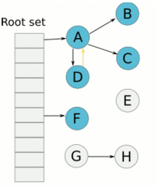
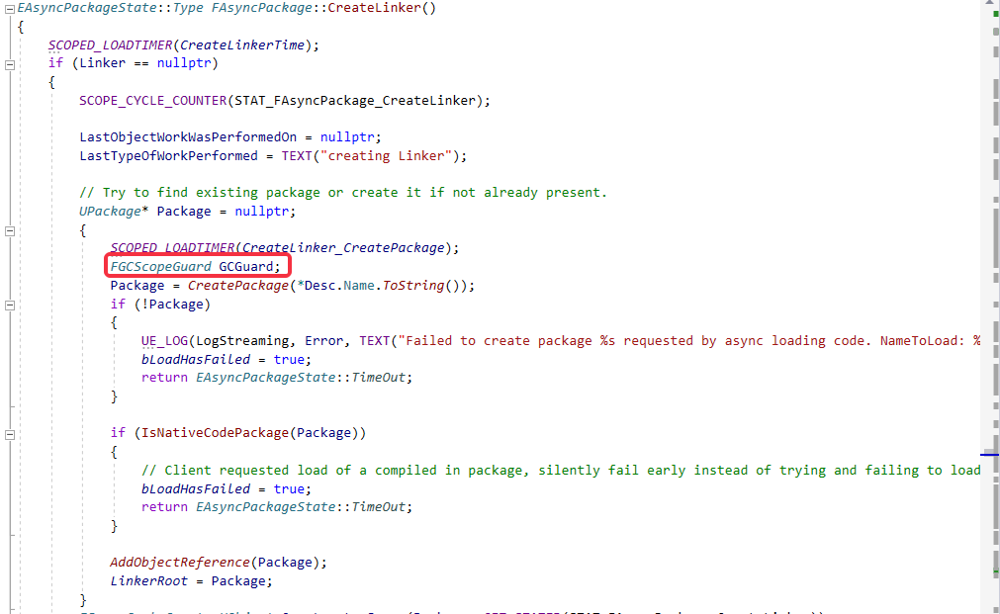
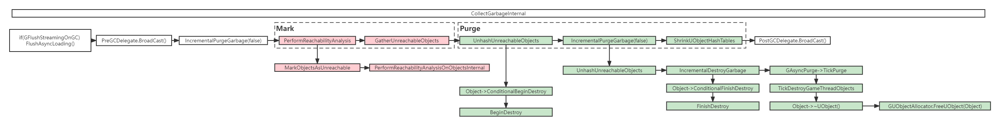

# 垃圾回收

> https://zhuanlan.zhihu.com/p/67055774

## 简介

UE所采用的GC算法为标记-清除（Mark-Sweep）垃圾回收。一次垃圾回收分为两个阶段：标记阶段（Mark）与清除阶段（Purge）。

标记阶段会从一个根集合出发，遍历所有的可达对象，遍历完成后就可以得到可达对象和不可达对象。

清除阶段会将标记阶段所得到的不可达对象清除。

不同于标记阶段要求一帧内完成，清除阶段可以分帧执行，因为不可达对象将永远不可能被访问到，避免一次清理过多对象导致单帧卡顿。



由于UE提供了UObject对象系统，因此可以很好的利用这一个算法的做垃圾回收。

## 何时进行

### 主动引发

可以手动调用GC，例如卸载一个资源后，立刻进行一次GC。

主动引发的方式有两种：

+ 调用ForceGarbageCollection，让World下次Tick时进行垃圾回收
+ 直接调用CollectGarbage进行垃圾回收

### 自动引发

大部分情况下垃圾回收操作都是由UE自动触发的。当World进行tick时，会调用UEngine::ConditionalCollectGarbage()函数，当满足一定条件的时候会调用CollectGarbage。具体条件包括：

+ 是否设置了FullPurgeTriggered（强制清除）
+ 是否有任意一个World对象设置了bBegunPlay，如果有才需要做垃圾回收
+ 是否设置了ShouldDelayGarbageCollect（有些操作需要保证当前帧不执行垃圾回收）
+ 增量清除模式下，两次垃圾回收的时间是否超过了TimeBetweenPurgingPendingKillObjects（配置项，default 60s）
+ 可用内存是否小于GLowMemoryIncrementalGCTimePerFrame

## 具体流程

不管通过那种方式进行调用，最后都会调用到GarbageCollection.cpp中的CollectGarbage，定义如下

```c++
void CollectGarbage(EObjectFlags KeepFlags, bool bPerformFullPurge)
{
	// No other thread may be performing UObject operations while we're running
	AcquireGCLock();

	// Perform actual garbage collection
	CollectGarbageInternal(KeepFlags, bPerformFullPurge);

	// Other threads are free to use UObjects
	ReleaseGCLock();
}
```

过程包括：获得GC锁，执行实际的垃圾回收，释放GC锁。

以下简单解释一下GC锁部分，主要的垃圾回收逻辑CollectionGarbageInternal下面单独拿出来讨论。

### GC锁

因为GC过程是多线程的，所以要设置GC锁，防止其它线程对UObject的修改，会与GC冲突，主要用于保护异步加载流程。

GC锁是一个广义的概念，在UE4中，具象化为全局的单例对象：`FGCCSyncObject`。当获取不到锁的时候，会阻塞当前线程。以下举两个例子用于说明在Game/Non-Game Thread中，如何使用这个单例对象进行锁的操作。

在Game Thread中，CollectGarbage中的锁获取和释放是针对这个对象进行操作的。见以下`AcquireGCLock` 和`ReleaseGCLock`的定义（省略了部分不重要的内容）。

```c++
void AcquireGCLock()
{
	FGCCSyncObject::Get().GCLock();
}

void ReleaseGCLock()
{
	FGCCSyncObject::Get().GCUnlock();
}
```

而对于Non-GameThread，可以在异步加载流程中看到FGCScopeGuard。FGCScopeGuard是关于FGCCSyncObject的RAII，如下定义。

```c++
FGCScopeGuard::FGCScopeGuard()
{
    FGCCSyncObject::Get().LockAsync();
}

FGCScopeGuard::~FGCScopeGuard()
{
	FGCCSyncObject::Get().UnlockAsync();
}
```

关于异步加载中该锁的具体使用，见以下情况，加上GC锁可以防止Package还没被加上引用的时候就被清理掉：



关于FGCCSyncObject本身不太重要，关注其实现可以阅读[UE4 垃圾回收](https://zhuanlan.zhihu.com/p/67055774)中的**FGCSyncObject**部分。

### CollectionGarbageInternal

真正执行具体垃圾回收操作的位置。首先看一下函数的定义：

```c++
/** 
 * Deletes all unreferenced objects, keeping objects that have any of the passed in KeepFlags set
 *
 * @param	KeepFlags			objects with those flags will be kept regardless of being referenced or not
 * @param	bPerformFullPurge	if true, perform a full purge after the mark pass
 */
void CollectGarbageInternal(EObjectFlags KeepFlags, bool bPerformFullPurge)
```

+ KeepFlags：表示持有当前标记的Object无论是否被引用都会被保留
+ bPerformFullPurge：是否在Mark完之后直接Purge，而不是分帧清除

在深入到具体细节前，先看一下整体流程：




由于下面具体操作中大量涉及GUObjectArray，首先需要介绍这个对象。UE4提供的对象系统是基于UObject，从GUObjectArray的名字大致可以猜出其为包含所有UObject的数组。但更准确来说，GUObjectArray中保存的对象类型其实是FUObjectItem。来简单看一下FUObjectItem的定义：

```c++
/**
* Single item in the UObject array.
*/
struct FUObjectItem
{
	// Pointer to the allocated object
	class UObjectBase* Object;
	// Internal flags
	int32 Flags;
	// UObject Owner Cluster Index
	int32 ClusterRootIndex;	
	// Weak Object Pointer Serial number associated with the object
	int32 SerialNumber;
    ...
}
```

FUObjectItem其实只是UObject在GUObjectArray的包装类，额外添加了一些业务逻辑不关心，但服务于其它功能的变量，例如这里的Flags将在GC中发挥作用。

但这样还不完全足够，如果只是为了添加一些额外的变量，直接存放在UObject其实也可以，在这里之所以这样做，更多是为了Cache友好。由于继承于UObject的对象大小各不相同，不可能用一块同一个内存将其存放，利用UObjectItem包装后，所有存在于UObjectArray中的对象内存都是连续的，对于一些需要高频并且性能相关的功能，可以直接利用UObjectItem中的变量进行查询，减少对UObject本身的访问，加快数据的访问速度。

这里顺便提一嘴关于GUObjectArray中的排布。UE中所有的对象都是UObject，包括UClass\UStruct，因此所有内容都会被包含于GUObjectArray中，但其中有一部分内容是永远不会成为垃圾被回收掉的，因此UE在GUObjectArray人为的划分了两个区，前半区存储了所有固化的、不会被垃圾回收的内容，例如静态注册的UClass对象，剩下的才是可能成为垃圾的对象，而GC只需要针对这一部分非固化的内容进行处理。


以下按Mark和Purge两个阶段简单介绍其核心功能

#### Mark

+ MarkObjectsAsUnreachable：并行遍历GUObjectArray，收集所有的根集存到ObjectsToSerialize中，并且标记所有不为根集的对象为Unreachable

+ PerformReachabilityAnalysisOnObjectsInternal：并行遍历上一步收集到的ObjectsToSerialize中的每个对象，去除所有ObjectsToSerialize中对象所引用对象的Unreachable标记。到了这一步，所有没有标记了Unreachable的对象就被认为是不可达的了。

+ GatherUnreachableObject：并行遍历GUObjectArray中所有的对象，取出其中所有标记了Unreachable的对象，加入到GUnreachableObjects中

#### Purge

+ UnhashUnreadObjects：对所有的不可达对象设置RF_BeginDestroyed并执行BeginDestroy方法
+ IncrementalPurgeGarbage：遍历所有不可达对象，有些无法立刻清除，会存到GGCObjectsPendingDestruction中，之后再处理。否则调用FinishDestroy方法
+ GAsyncPurge->TickPurge：最后这里会执行真正的清理流程，调用Object的析构函数，释放内内存空间

在这两个阶段中，大部分内容都比较直观，除了重载某些函数可对GC做一些定制化，其中计算可达性的PerformReachabilityAnalysisOnObjectsInternal方法也涉及到一些可重载内容，是我们在写代码时候需要关注的，并且其中内容较为复杂，值得单独拿出来讨论。

#### PerformReachabilityAnalysisOnObjectsInternal

要理解这个过程，首先需要理解一个重要的概念 —— Token Stream。

##### Token Stream

结合UE4提供的UObject系统，想要计算可达性，最朴素的想法就是直接遍历对象的所有标记了UProperty的成员变量，将其标记为可达。但这种方式效率是比较低的（再次强调GC是高频且性能相关的，所以上很多优化手段不可避免），在UProperty中，其实有很多不需要进行计算的内容，存在很多非Object类型引用的Property（如int、float...），所以UE提供了一个更快速的访问垃圾回收所关心属性和方法的对象 —— Token Stream，描述了类对象的引用情况。

按惯例，先看一下Token Stream的定义

```c++
struct COREUOBJECT_API FGCReferenceTokenStream
{
    ...
private:
    /** Token array */
	TArray<uint32> Tokens;
#if ENABLE_GC_OBJECT_CHECKS
    TArray<FName> TokenDebugInfo;
#endif
}
```

实际上，ReferenceTokenStream保存了以uint32表示的Token数组（DebugInfo不需要关心），并且提供了一些与Tokens相关的方法，因此想弄明白Token Stream，只需要了解Tokens中存储内容的含义即可。Tokens中实际存储的内容为FGCReferenceInfo，来看一下它的定义：

```c++
struct FGCReferenceInfo
{
	union
	{
		struct
		{
			uint32 ReturnCount	: 8;
			uint32 Type			: 5; 
			uint32 Offset		: 19;
		};
		uint32 Value;
	};
};
```

FGCReferenceInfo中将三个变量合并为了一个uint32的数据类型，其中三个变量的含义分别为：

+ ReturnCount：返回的嵌套深度。例如：1表示数组中的成员，2表示结构体数组中，成员的变量
+ Type：Token的类型Enum - EGCRefenceType，下面详细展开
+ Offset：在对象中的偏移量

关于Type，定义如下：

```c++
enum EGCReferenceType
{
	GCRT_None			= 0,
	GCRT_Object,
	GCRT_Class,
	GCRT_PersistentObject,
	GCRT_ExternalPackage,				// Specific reference type token for UObject external package
	GCRT_ArrayObject,
	GCRT_ArrayStruct,
	GCRT_FixedArray,
	GCRT_AddStructReferencedObjects,
	GCRT_AddReferencedObjects,
	GCRT_AddTMapReferencedObjects,
	GCRT_AddTSetReferencedObjects,
	GCRT_AddFieldPathReferencedObject,
	GCRT_ArrayAddFieldPathReferencedObject,
	GCRT_EndOfPointer,
	GCRT_EndOfStream,
	GCRT_NoopPersistentObject,
	GCRT_NoopClass,
	GCRT_ArrayObjectFreezable,
	GCRT_ArrayStructFreezable,
	GCRT_Optional,
	GCRT_WeakObject,
	GCRT_ArrayWeakObject,
	GCRT_LazyObject,
	GCRT_ArrayLazyObject,
	GCRT_SoftObject,
	GCRT_ArraySoftObject,
	GCRT_Delegate,
	GCRT_ArrayDelegate,
	GCRT_MulticastDelegate,
	GCRT_ArrayMulticastDelegate,
};
```

当我们处理Token Stream的时候，会一个个取出其中的Token，根据Token的**Type**决定使用的具体的处理方法（switch case），利用**Offset**去获取属性。这样只需要保证在Token Stream建立时，只存储和垃圾回收相关的内容，减少了不必要的遍历。

Token Stream的建立方式为UClass::AssembleReferenceTokenStream，简单描述如下：

1. 遍历自身的UProperty（ExcludeSuper），依次调用它的EmitReferenceInfo，不同的UProperty可以重载这个方法，将编码的Token信息加入到Token Stream中。
2. 如果有父类，递归调用父类的AssembleReferenceTokenStream方法，将Token添加到当前Stream之前
3. 如果当前类有AddReferencedObjects函数，将其加入Token中，该函数将用于可达性分析
4. TokenStream添加完毕，把"EndOfStream"token添加到TokenStream，并进行Shrink
5. ClassFlags中把CLASS_TokenStreamAssembled设为true

到此为止，Token Stream的建立就完成了，接下来只需要在可达性分析的时候直接利用UClass的Token Stream进行分析即可得到所有可达对象。


## 小结

对于非继承于Object的对象，UE也提供了支持垃圾回收的方案。