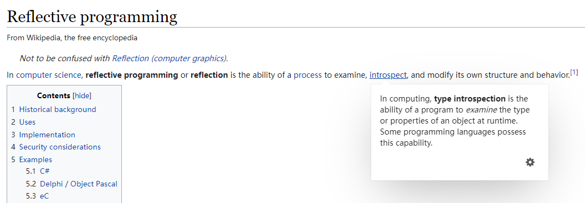
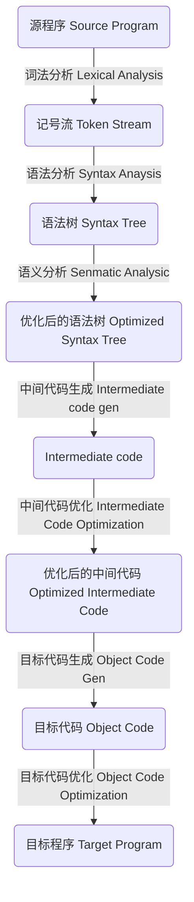
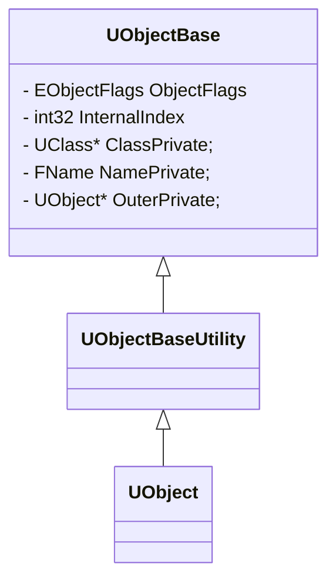
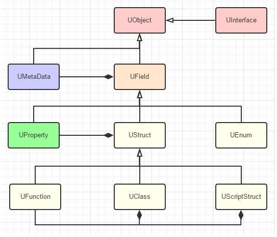

# Reflection

## 问题

+ 像Python一样，直接 `obj.__class__` 就拿到所有关于object的类型信息
+ 像Python一样，利用字符串调用函数和获取属性`getattr('foo')`
+ 通过字符串去创建一个对象
+ 怎么才能更方便的做序列化

## What

### [RTTI](https://docs.microsoft.com/en-us/cpp/cpp/run-time-type-information?view=msvc-170#:~:text=Run-time%20type%20information%20%28RTTI%29%20is%20a%20mechanism%20that,of%20class%20libraries%20were%20implementing%20this%20functionality%20themselves.)

Run-time type information (RTTI) is a mechanism that allows the type of an object to be determined during program execution.

+ dynamic_cast
+ typeid
+ type_info
  + Used to hold the type information returned by the **`typeid`** operator.

```c++
class type_info {
public:
    type_info(const type_info& rhs) = delete; // cannot be copied
    virtual ~type_info();
    size_t hash_code() const;
    _CRTIMP_PURE bool operator==(const type_info& rhs) const;
    type_info& operator=(const type_info& rhs) = delete; // cannot be copied
    _CRTIMP_PURE bool operator!=(const type_info& rhs) const;
    _CRTIMP_PURE int before(const type_info& rhs) const;
    size_t hash_code() const noexcept;
    _CRTIMP_PURE const char* name() const;
    _CRTIMP_PURE const char* raw_name() const;
};
```

### Reflection

[Reflection and Semantics in a Procedural Language](http://publications.csail.mit.edu/lcs/pubs/pdf/MIT-LCS-TR-272.pdf)

> Brian Cantwell Smith. "Reflection and Semantics in a Procedural Language". PhD. Thesis. Massachusetts Institute of Technology. MIT-LCS-TR-272. January 1982. 

[WikiPedia](https://en.wikipedia.org/wiki/Reflective_programming)

> 

[Java(Oracle) - Package java.lang.reflect Description](https://docs.oracle.com/javase/8/docs/api/java/lang/reflect/package-summary.html#:~:text=Provides%20classes%20and%20interfaces%20for%20obtaining%20reflective%20information,operate%20on%20their%20underlying%20counterparts%2C%20within%20security%20restrictions.)

> Provides classes and interfaces for obtaining reflective information about classes and objects. Reflection allows programmatic access to information about the fields, methods and constructors of loaded classes, and the use of reflected fields, methods, and constructors to operate on their underlying counterparts, within security restrictions.

[C# - Reflection](https://docs.microsoft.com/en-us/dotnet/csharp/programming-guide/concepts/reflection)

> Reflection provides objects (of type [Type](https://docs.microsoft.com/en-us/dotnet/api/system.type)) that describe assemblies, modules, and types. You can use reflection to dynamically create an instance of a type, bind the type to an existing object, or get the type from an existing object and invoke its methods or access its fields and properties. If you are using attributes in your code, reflection enables you to access them. 

#### Function

+ 获得对象的信息：Module、类型、属性、方法
+ 动态生成对象，甚至新生成类
+ 可以在运行时利用反射信息访问对象的属性，方法

## Why

思考：new一个对象，调用一个函数很简单，为什么非得用反射，反射的意义？

+ 可以通过配置文件快速修改运行时的对象，不需要重新编译
+ 放置在游戏场景里的actor实例，如何感知自己是啥类型，有哪些属性需要暴露给编辑器修改？如何根据类型再去生成一系列兄弟actor？所以ue里面一些很基础的接口get actor of class, spawn actor from class 都是依赖反射
+ 序列化、反序列化变得相当简单

思考：反射有什么缺点吗

+ 对于非原生支持反射的语言而言，实现起来并不容易
+ 会有性能损耗
+ 不利于代码的阅读，难以从源代码理清逻辑
+ 破坏类的封装性

## How

### 其它语言的实现方法

####  Java


#### C#


### C++反射实现

常用套路分为流派：

1. 手动注册类型信息
2. 预编译器生成类型信息

#### 手动注册类型信息

##### 宏

```c++
struct Test
{
    DECLARE_STRUCT(Test);
    DEFINE_FIELD(1, int, a)
    DEFINE_FIELD(2, int, b)
    DEFINE_FIELD(3, int, c)
    DEFINE_METADATA(3)
}
```

##### 模版 [C++ Reflection Library - rttr](https://github.com/rttrorg/rttr)

Manual registration

```c++
#include <rttr/registration>
using namespace rttr;

struct MyStruct {
    MyStruct() {};
    
    void func(double) {};
    int data;
};

RTTR_REGISTRATION
{
    registration::class_<MyStruct>("MyStruct")
         .constructor<>()
         .property("data", &MyStruct::data)
         .method("func", &MyStruct::func);
}
```

```c++
// Iterate over members
{
    type t = type::get<MyStruct>();
    for (auto& prop : t.get_properties())
        std::cout << "name: " << prop.get_name();

    for (auto& meth : t.get_methods())
        std::cout << "name: " << meth.get_name();
}

// Constructing types
{
    type t = type::get_by_name("MyStruct");
	variant var = t.create();    // will invoke the previously registered ctor

	constructor ctor = t.get_constructor();  // 2nd way with the constructor class
	var = ctor.invoke();
	std::cout << var.get_type().get_name(); // prints 'MyStruct'
}

// Set/get properties
{
    MyStruct obj;

    property prop = type::get(obj).get_property("data");
    prop.set_value(obj, 23);

    variant var_prop = prop.get_value(obj);
    std::cout << var_prop.to_int(); // prints '23'
}

// Invoke Methods
{
    method meth = type::get(obj).get_method("func");
    meth.invoke(obj, 42.0);

    variant var = type::get(obj).create();
    meth.invoke(var, 42.0);
}
```

#### 预编译器生成类型信息

##### 编译器实现




编译器在编译的过程中可以获得所有的类型信息，因此分析编译器生成的中间文件提取数据信息可能是一条可行的路。只需要去分析语义分析后的语法树，此时所有的变量名和函数名都已经定位出来了。

但是这个方法过渡依赖编译器，一旦使用不同的编译器或者编译器版本升级了，就需要去修改生成代码，有点麻烦。

##### 工具生成代码 qt

其实编译器也只是将人能够理解的语言（代码）转换成机器能够理解的语言（字节码）， 既然没办法控制编译器的种类和版本，自然而然地就会考虑到自己去写一个类似编译器的东西去解析代码。不同于编译器是用来生成字节码的，我们只需要其中的部分信息，因此不需要对所有内容进行解析和编译，只需要做一些额外的信息用于标注哪些内容是被关注的即可，我们根据这些信息去生成所需的内容，QT和UE4就是这样做的。

QT有一个预编译器：MOC，在源码输入编译器之前，会先经过 MOC 处理一遍。在运行时，可以利用MOC扫描出来的信息实现反射的功能。

```c++

```


### UE4反射类型定义

https://cloud.tencent.com/developer/article/1606872

## When / Where / Who

UE4在什么时候执行了反射，在哪里执行了反射，生成的内容在哪里


# UE4反射机制

## UObject

要描述UE4的反射机制，首先先得了解UE4中的万物之源UObject

```c++
// .\Runtime\CoreUObject\Private\UObject\UObjectHash.cpp

FUObjectArray GUObjectArray;

class FUObjectHashTables
{
    ...
public:
    static FUObjectHashTables& Get()
	{
		static FUObjectHashTables Singleton;
		return Singleton;
	}
    ...
}

// .\Runtime\CoreUObject\Private\UObject\UObjectBase.cpp
UObjectBase::UObjectBase(...)
{
    AddObject(...);
}

void UObjectBase::AddObject(...)
{
    ...
    GUObjectArray.AllocateUObjectIndex(this);
    ...
    HashObject(this);
    ...
}
```

+ `FUObjectArray FUObjectArray`  是一个全局指针数组，存储了所有使用 `NewObject` 创建的对象
+ `FUObjectHashTables` 记录了对象间的各种关系，在 GC 销毁对象时，会释放 `FUObjectArray` 中的内存和 `FUObjectHashTables` 的对象关系


> 语法解释：`<|--` 表示继承，`+` 表示 `public`，`-` 表示 `private`



```c++

class COREUOBJECT_API UObjectBase
{
    ...

private:
    /** Flags used to track and report various object states. This needs to be 8 byte aligned on 32-bit
	    platforms to reduce memory waste */
	EObjectFlags					ObjectFlags;

	/** Index into GObjectArray...very private. */
	int32							InternalIndex;

	/** Class the object belongs to. */
	UClass*							ClassPrivate;

	/** Name of this object */
	FName							NamePrivate;

	/** Object this object resides in. */
	UObject*						OuterPrivate;
    
    ...
}

// .\Runtime\CoreUObject\Public\UObject\UObjectBaseUtility.h
class COREUOBJECT_API UObjectBaseUtility : public UObjectBase
{
    ...
}

// .\Runtime\CoreUObject\Public\UObject\Object.h
class COREUOBJECT_API UObject : public UObjectBaseUtility
{
    ...
}
```


### 使用

```c++
UCLASS()
class Project_API UMyClass : public UObject
{
    GENERATED_BODY()
public:
	UFUNCTION(BluprintCallable)
	void MyFunc();
private:
	UPROPERTY(EditAnywhere, BlueprintReadWrite, meta=(AllowPrivateAccess = "true"))
	int MyIntValue;
}
```




>1. UObject
>2. UField
>3. UStruct
>4. UProperty
>5. UEnum
>6. UClass
>7. UFunction
>8. UScriptStruct

## UnrealHeaderTool和UnrealBuildTool

### UHT解析原理

#### LL & LR


#### FHeaderParser::ParseHeader

