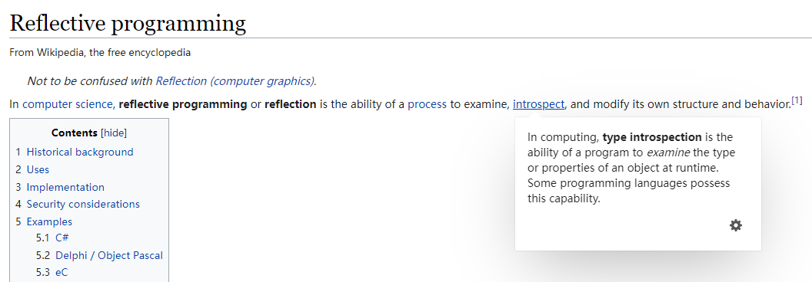
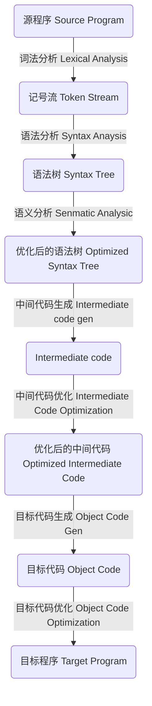

# 类型系统

> https://ue5wiki.com/wiki/12624/
>
> https://www.unrealengine.com/en-US/blog/unreal-property-system-reflection
>
> https://cloud.tencent.com/developer/article/1606872
>
> https://zhuanlan.zhihu.com/p/24319968
>
> https://zhuanlan.zhihu.com/p/60622181

如果说**TraceStack**回答了“我在哪里的问题”，那么**类型系统**就回答了“我是谁的问题？”， 至于“我在做什么”，那只有你自己知道了...

新增功能都来源于对现实的不满和新需求的渴望，类型系统也不例外。正是因为有一些缺少类型系统难以解决的问题，才促成了它的诞生。而我们通常所说的反射，其实是依赖于类型系统的运行时能力。

原生的C++是不支持类型系统的，因此会有很多问题是不好处理甚至无法处理的。举个例子，如果我们想在C++中想实现以下几个功能，那是白日做梦，而类型系统就是让梦想成真的良药。

+ 像Python一样，直接 `obj.__class__` 就拿到所有关于object的类型信息
+ 像Python一样，利用字符串调用函数和获取属性`getattr('foo')`
+ 通过字符串去创建一个对象
+ 方便地实现序列化

## 类型系统

C++明明有RTTI，多态也是面向对象的基本思想，能够在运行时确定对象的类型，这里面难道不包含类型系统吗？

### [RTTI](https://docs.microsoft.com/en-us/cpp/cpp/run-time-type-information?view=msvc-170#:~:text=Run-time%20type%20information%20%28RTTI%29%20is%20a%20mechanism%20that,of%20class%20libraries%20were%20implementing%20this%20functionality%20themselves.)

首先看一下官方对于RTTI的定义：

> Run-time type information (RTTI) is a mechanism that allows the type of an object to be determined during program execution.
>
> + dynamic_cast
> + typeid
> + type_info
>   + Used to hold the type information returned by the **`typeid`** operator.

```c++
class type_info {
public:
    type_info(const type_info& rhs) = delete; // cannot be copied
    virtual ~type_info();
    size_t hash_code() const;
    _CRTIMP_PURE bool operator==(const type_info& rhs) const;
    type_info& operator=(const type_info& rhs) = delete; // cannot be copied
    _CRTIMP_PURE bool operator!=(const type_info& rhs) const;
    _CRTIMP_PURE int before(const type_info& rhs) const;
    size_t hash_code() const noexcept;
    _CRTIMP_PURE const char* name() const;
    _CRTIMP_PURE const char* raw_name() const;
};
```

看看RTTI中重要的type_info里的成员（实现多态都仰仗着它），应该就可以放弃对C++类型系统的幻想了。type_info能够勉强回答狭义的”我是谁“这个问题：`const char* name() const`，但是对于”我拥有什么能力，拥有什么属性“这个问题，在type_info中毫无体现...那类型系统在C++更是无迹可寻了。

### 反射

反射的定义起源于Smith在1982年的一篇文章：[Reflection and Semantics in a Procedural Language](http://publications.csail.mit.edu/lcs/pubs/pdf/MIT-LCS-TR-272.pdf)

> Brian Cantwell Smith. "Reflection and Semantics in a Procedural Language". PhD. Thesis. Massachusetts Institute of Technology. MIT-LCS-TR-272. January 1982. 

对于这个概念，不同的网站和语言都给出了自己的定义：

[WikiPedia](https://en.wikipedia.org/wiki/Reflective_programming)

> 

[Java(Oracle) - Package java.lang.reflect Description](https://docs.oracle.com/javase/8/docs/api/java/lang/reflect/package-summary.html#:~:text=Provides%20classes%20and%20interfaces%20for%20obtaining%20reflective%20information,operate%20on%20their%20underlying%20counterparts%2C%20within%20security%20restrictions.)

> Provides classes and interfaces for obtaining reflective information about classes and objects. Reflection allows programmatic access to information about the fields, methods and constructors of loaded classes, and the use of reflected fields, methods, and constructors to operate on their underlying counterparts, within security restrictions.

[C# - Reflection](https://docs.microsoft.com/en-us/dotnet/csharp/programming-guide/concepts/reflection)

> Reflection provides objects (of type [Type](https://docs.microsoft.com/en-us/dotnet/api/system.type)) that describe assemblies, modules, and types. You can use reflection to dynamically create an instance of a type, bind the type to an existing object, or get the type from an existing object and invoke its methods or access its fields and properties. If you are using attributes in your code, reflection enables you to access them. 

总结一下，反射无外乎就是以下三种能力：

+ 获得对象的信息：Module、类型、属性、方法
+ 动态生成对象，甚至新生成类
+ 可以在运行时利用反射信息访问对象的属性，方法

## Implement

有了类型系统，能够做什么呢？

+ 序列化
+ 垃圾回收
+ 网络复制
+ Blueprint和C++的通信

## Why

思考一下，new一个对象，调用一个函数很简单，为什么非得用反射，反射的意义？

+ 可以通过配置文件快速修改运行时的对象，不需要重新编译
+ 放置在游戏场景里的actor实例，如何感知自己是啥类型，有哪些属性需要暴露给编辑器修改？如何根据类型再去生成一系列兄弟actor？所以ue里面一些很基础的接口get actor of class, spawn actor from class 都是依赖反射
+ 序列化、反序列化变得相当简单

反射有什么缺点吗？

+ 对于非原生支持反射的语言而言，实现起来并不容易
+ 会有性能损耗
+ 不利于代码的阅读，难以从源代码理清逻辑
+ 破坏类的封装性

## How

但不能因为C++没有类型系统就放弃它了...C++是一门强大的语言，既然标准不提供类型系统，那就自己实现一套呗。

### 其它语言

模仿是进步最快的途径。。要自己实现一套类型系统，可以先看看已有的反射系统是怎么做的。

####  Java

```java
// TODO
```

#### C#

```c#
// Gets the Type.
Type t = Type.GetType("System.Reflection.FieldInfo");
// Specifies the member for which you want type information.
ConstructorInfo[] ci = t.GetConstructors(BindingFlags.Public);
MethodInfo myMethodInfo = t.GetMethod("GetValue");
FieldInfo[] fi = t.GetFields(BindingFlags.Static | BindingFlags.NonPublic | BindingFlags.Public);
PropertyInfo[] pi = t.GetProperties(BindingFlags.Static | BindingFlags.NonPublic | BindingFlags.Public);
EventInfo[] ei = t.GetEvents(BindingFlags.Static | BindingFlags.NonPublic | BindingFlags.Public);


// Attribute
class MyStruct
{
    [Conditional("DEBUG")]
    public static void Message(string msg)
    {
        Console.WriteLine(msg);
    }
}
```

Attribute 是一种可由用户自由定义的修饰符（Modifier），可以用来修饰各种需要被修饰的目标。是为了给关联的内容添加*Metadata*，加入额外的信息。

### C++反射实现

常用套路分为流派：

1. 手动注册类型信息
2. 预编译器生成类型信息

#### 手动注册类型信息

##### 宏

```c++
struct MyStruct
{
    DECLARE_STRUCT(MyStruct);
    DEFINE_FIELD(1, int, a)
    DEFINE_FIELD(2, int, b)
    DEFINE_FIELD(3, int, c)
    DEFINE_METADATA(3)
}
```

利用宏的写法可以获得所有数据信息，具体怎么做存储和读写可以千变万化，甚至配合模板来做。

举个例子（以下是伪码，未验证过）

```c++
#define DECLARE_STRUCT(NAME) CLASS = NAME

#define DEFINE_FIELD(Index, Type, Name) \
	Type Name(); \
	G_ClassMap[CLASS].Property[Index] = &CLASS::Name;
```

在使用方法的时候， 只需要查找注册好的表的内容。

##### 模版 [C++ Reflection Library - rttr](https://github.com/rttrorg/rttr)

Manual registration

```c++
#include <rttr/registration>
using namespace rttr;

struct MyStruct {
    MyStruct() {}
    
    void show(double v) { std::cout << v << std::endl; }
    int data;
};

RTTR_REGISTRATION
{
    registration::class_<MyStruct>("MyStruct")
         .constructor<>()
         .property("data", &MyStruct::data)
         .method("show", &MyStruct::func);
}

// Iterate over members
{
    type t = type::get<MyStruct>();
    for (auto& prop : t.get_properties())
        std::cout << "name: " << prop.get_name();

    for (auto& meth : t.get_methods())
        std::cout << "name: " << meth.get_name();
}

// Constructing types
{
    type t = type::get_by_name("MyStruct");
	variant var = t.create();    // will invoke the previously registered ctor

	constructor ctor = t.get_constructor();  // 2nd way with the constructor class
	var = ctor.invoke();
}

// Set/get properties
{
    MyStruct obj;

    property prop = type::get(obj).get_property("data");
    prop.set_value(obj, 23);

    std::cout << prop.get_value(obj).to_int() << std::endl; // prints '23'
}

// Invoke Methods
{
    type::get(obj).get_method("show").invoke(obj, 42.0);
}
```

#### 预编译器生成类型信息

##### 编译器实现




编译器在编译的过程中可以获得所有的类型信息，因此分析编译器生成的中间文件提取数据信息可能是一条可行的路。只需要去分析语义分析后的语法树，此时所有的变量名和函数名都已经定位出来了。

但是这个方法过度依赖编译器，一旦使用不同的编译器或者不同版本的编译器，就需要去修改生成代码，比较麻烦。

##### 工具生成代码 QT

换个角度想，编译器只是将人所理解的语言（代码）转换成机器所理解的语言（机器码）， 既然没办法控制编译器的种类和版本，自然而然地就会考虑到自己去写一个类似编译器的东西去解析代码。不同于编译器是用来生成机器码的，我们只需要其中的部分信息，因此不需要对所有内容进行解析和编译，只需要针对性的设定一些额外的信息用于标注哪些内容是被关注的即可，我们根据这些信息去生成所需的内容，QT和UE4就是这样做的。

QT有一个预编译器：MOC，在源码输入编译器之前，会先经过 MOC 处理一遍。在运行时，可以利用MOC扫描出来的信息实现反射的功能。

```c++
#include <QObject>
class MyStruct : public QObject
{
    Q_OBJECT
public:
    Q_INVOKABLE explicit MyStruct(QObject *parent = nullptr);

public slots:
    void show() { qDebug() << __FUNCTION__ << this->metaObject()->className();}
    int data;
    
MyStruct obj;
const QMetaObject* meta = obj.metaObject();
const QMetaObject* meta1 = &MyStruct::staticMetaObject;

// Iterate over members
{
    for(size_t index = 0; index < meta->propertyCount(); ++index)
        std::cout << "name: " << meta->property(index).name();

    for(size_t index = 0; index < meta->methodCount(); ++index)
        std::cout << "name: " << meta->method(index).name();
}

// Constructing types
{
	MyStruct* copy = meta->newInstance();
}

// Set/get properties
{
	QMetaProperty property = meta->property(indexOfProperty("data"));
    property.write(&obj, 23);
    
	std::cout << property.read() << std::endl;
}

// Invoke Methods
{
    QMetaObject::invokeMethod(obj, "show");
}
};
```

既然UE4选择了**工具生成代码**这种方式来实现类型系统，要了解这其中的玄机，首先我们得好好聊一聊这个工具本身：[UBT](UBT&UHT.md)