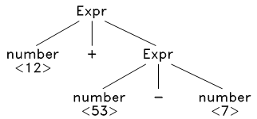
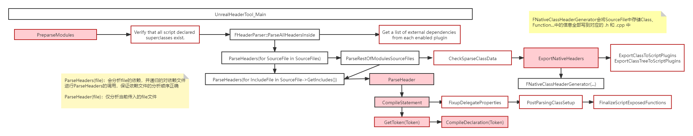

# UnrealBuildTool & UnrealHeaderTool

[Reflection](Reflection.md)中谈到，由于C++原生不支持类型系统，要实现反射的方式有很多种，最终UE4选择了类似于QT的方案：使用工具生成代码。

与QT的MOC相似，UE4项目中的代码会先经过**UnrealHeaderTool（简称UHT）**预处理，生成一些额外的信息用于类型系统的实现，然后将这些额外生成的文件一起加入到接下来发生的项目文件编译流程中。

对于类型系统，我们需要UHT来生成额外的文件，手工维护这样的编译流程是比较麻烦的，因此UE4为此提供了**UnrealBuildTool（简称UBT）**用于解决编译环境和内容收集的问题。

>UBT和UHT的作用：
>
>+ UBT 的作用是收集和构建编译环境，调用 UHT 生成代码，然后**调用真正的编译器进行编译**
>+ UHT 的作用是把项目中所有代码里的 UHT 标记翻译为真正的 C++ 代码（如 `UCLASS/GENERATED_BODY` 等等），它属于 UBT 工作流程中的一环

下面先介绍UBT，然后再介绍UHT。

# UnrealBuildTool

UBT在类型系统中不是特别重要，因此以下仅单纯罗列UBT的功能：

- Scans solution directory for modules and plug-ins
- Determines all modules that need to be rebuilt
- Invokes UHT to parse C++ headers
- Creates compiler & linker options from .Build.cs & .Target.cs
- Executes platform specific compilers (VisualStudio, LLVM)

只需记住，UHT是UBT的一个子过程，在进行正式的项目编译之前会先利用UHT进行代码的预处理。

# UnrealHeaderTool

## 定义

UHT是类型系统的核心所在，首先看一下它的官方定义

> https://docs.unrealengine.com/4.27/en-US/ProductionPipelines/BuildTools/UnrealHeaderTool/
>
> **UnrealHeaderTool (UHT)** is a custom parsing and code-generation tool that supports the UObject system. Code compilation happens in two phases:
>
> 1. UHT is invoked, which parses the C++ headers for Unreal-related class metadata and generates custom code to implement the various UObject-related features.
> 2. The normal C++ compiler is invoked to compile the results.

简单总结一下，包括三个功能：

- Parses all C++ headers containing UClasses
- Generates glue code for all Unreal classes & functions
- Generated files stored in Intermediates directory

其中glue code是根据UE所提供的UHT标记生成的，UE 的 UHT 标记包括但不限于：

- [Function Specifiers](https://docs.unrealengine.com/en-US/Programming/UnrealArchitecture/Reference/Functions/Specifiers/index.html)
- [Metadata Specifiers](https://docs.unrealengine.com/en-US/Programming/UnrealArchitecture/Reference/Metadata/index.html)
- [Property Specifiers](https://docs.unrealengine.com/en-US/Programming/UnrealArchitecture/Reference/Properties/Specifiers/index.html)
- [Struct Specifiers](https://docs.unrealengine.com/en-US/Programming/UnrealArchitecture/Reference/Structs/Specifiers/index.html)
- [Interfaces](https://docs.unrealengine.com/en-US/Programming/UnrealArchitecture/Reference/Interfaces/index.html)

对某些标记不太了解或者想了解更多的UHT标记，可以阅读 `Runtime\CoreUObject\Public\ObjectMacros.h` 。

了解UHT的基本定义后，接下来将对其进行原理和代码分析。

## 原理解析

UHT采用的是传统的LL分析法手写代码，而并没有采用LR生成代码。好处就是相对来说比较简单，可以灵活地写逻辑（但就是代码量有点太大了...光HeaderParser.cpp 就有一万多行）。

### LL分析器

以下简单介绍LL分析器，详细内容可以参考 [网页](https://www.bookstack.cn/read/pandolia-tinyc/about.md) 或者 [编译原理的龙书](https://item.jd.com/10058776.html)

> Definition：LL分析器是一种处理某些**上下文无关文法**的**自顶向下分析**器。因为它**从左到右**处理输入，再对句型执行最左推导出**语法树**。

> **上下文无关语法（context-free grammar）** —— (T, N, P, S) 
>
> + T - 终结符（terminal）集合：无法推导出新的符号（TOKEN）
> + N - 非终结符（nonterminal）集合：产生式左边的符号，可以推导出新的内容
> + P - 产生式（production）集合：一个描述符号串如何转换的规则
> + S - 起始符号 S （start symbol）： N 中的一个特定的元素

> **自顶向下分析**就是从起始符号开始，不断的挑选出合适的产生式，将中间句子中的非终结符的展开，最终展开到给定的句子

利用LL分析器，可以将表达式`12 + 53 - 7` 是否满足语法要求，并转换成以下的抽象语法树(AST)，这棵AST将用于后面的优化和中间代码生成。



**P - 产生式（production）集合**

```ps
1. S -> Expr
2. Expr -> Expr op Expr | (Expr) | number
3. op   -> + - * /
4. number -> [0-9]+
```

| Working-string            | Production           | Final-string      |
| ------------------------- | -------------------- | ----------------- |
| **S**                     | S -> Expr            | **12** + 53 - 7   |
| **Expr**                  | Expr -> Expr op Expr | **12** + 53 - 7   |
| **Expr** op Expr          | Expr -> number       | **12** + 53 - 7   |
| *Expr* **op** Expr        | op -> +              | *12 +* 53 - 7     |
| *Expr +* **Expr**         | Expr -> Expr op Expr | *12 +* **53** - 7 |
| *Expr +* **Expr** op Expr | Expr -> number       | *12 +* **53** - 7 |
| *Expr + Expr* **op** Expr | op -> -              | *12 + 53* **-** 7 |
| *Expr + Expr -* **Expr**  | Expr -> number       | *12 + 53 -* **7** |

### 代码生成

理解了基本的LL操作后，再回过头来看UHT的实现就会相对简单一些了。特别声明，UHT中是LL(1)的解析器，这里的“1”指的是在做语法分析的时候只会提前看1个Token，对于符号解析来说足够了（比如说某些表达式在特定的产生式集合下会产生歧义，能够产生不同的表达式，这个时候可能就需要再往前看一个Token才能确定，但这样还要涉及到预判和回退，太复杂了）

>以下所有内容都在Programs.UnrealHeaderTool项目工程中，代码都在`Programs\UnrealHeaderTool\Private\`文件夹中
>
>**解析入口**
>
>```c++
>// UnrealHeaderToolMain.cpp
>INT32_MAIN_INT32_ARGC_TCHAR_ARGV() // entry
>{
>    ...
>    ECompilationResult::Type Result = UnrealHeaderTool_Main(ModuleInfoFilename);
>    ...
>}
>```
>
>**几个比较重要的文件**
>
>+ `ClassMaps`：一些全局定义
>+ `CodeGenerator`、`HeaderParser`、`BaseParser`：具体Parse代码

#### 流程图

总体流程如下图表示，简单来说就是可以分为扫描和生成两个阶段。在扫描解读分析所有需要分析的头文件中的特定标记（UClass，UFunction，GENERATED_BODY...），收集这些特定标记相关的内容；得到这些信息后，再生成阶段根据扫描得到的内容去生成 .h 和 .cpp 文件。



#### 重要的函数 GetToken 和 CompileDeclaration

UHT因为是工具代码，很多很杂，如果要全部看完不太理智..弄清楚以下两个函数的原理，关注`CompileDeclaration`中具体`Token`对应的实现就可以比较轻松地理解扫描阶段的流程。对于导出过程，可以关注`FNativeClassHeaderGenerator` 这个类，所有的导出相关操作都在其构造函数中，但具体需要导出什么内容，留待下一节讨论。

##### GetToken

获得一个Token，并将返回值传到参数FToken& Token中

```c++
bool FBaseParser::GetToken(FToken& Token, ...)
{
    if( (c>='A' && c<='Z') || (c>='a' && c<='z') || (c=='_') ) {...}
    else if ( !bNoConsts && ((c>='0' && c<='9') || ((c=='+' || c=='-') && (p>='0' && p<='9'))) ) {...}
    ...
}
```

##### CompileDeclaration

根据拿到的Token和上下文环境进行解析，写入相应class的meta信息

```c++
bool FHeaderParser::CompileDeclaration(..., FToken& Token)
{
    ...
    if (... (Token.Matches(TEXT("GENERATED_BODY"), ESearchCase::CaseSensitive) ...)
    {
        RequireSymbol(TEXT('('), Token.Identifier);
		CompileVersionDeclaration(GetCurrentClass());
		RequireSymbol(TEXT(')'), Token.Identifier);
        
		FClassMetaData* ClassData = GetCurrentClassData();

		ClassData->GeneratedBodyMacroAccessSpecifier = CurrentAccessSpecifier;
		ClassData->SetGeneratedBodyLine(InputLine);
    }
        
    
	if (Token.Matches(TEXT("UFUNCTION"), ESearchCase::CaseSensitive))
	{
		CompileFunctionDeclaration(AllClasses);
		return true;
	}
    if (Token.Matches(TEXT("UPROPERTY"), ESearchCase::CaseSensitive))
	{
		CompileVariableDeclaration(AllClasses, GetCurrentClass());
		return true;
	}
	if (Token.Matches(TEXT("UENUM"), ESearchCase::CaseSensitive))
	{
		CompileEnum();
		return true;
	}

    ...
}

void FHeaderParser::CompileFunctionDeclaration(FClasses& AllClasses)
{
    FFuncInfo FuncInfo;
	FuncInfo.MacroLine = InputLine;
    if (CurrentAccessSpecifier == ACCESS_Public)
    {
        FuncInfo.FunctionFlags |= FUNC_Public;
    }
    ... // 不断地调用GetToken，匹配写好的规则，填充FuncInfo
	UFunction* TopFunction = CreateFunction(FuncInfo);
    
    // Get parameter list.
	ParseParameterList(AllClasses, TopFunction, false, &MetaData);
    
    ... // 继续不断地调用GetToken

    AddMetaDataToClassData(TopFunction, MoveTemp(MetaData));
    
    ...
}
```

### 内容分析

大致了解了UHT是如何根据特定标记生成信息时，我们还留下了一个问题，在生成阶段中，UHT根据得到的信息，生成了什么内容？换句话说，生成的 .h 和 .cpp 文件中到底包含了什么样的内容，才能够让类型系统运转起来。

不妨换个角度思考这个问题：**最后生成的内容**是根据UHT在扫描阶段**所存储的信息**决定的，而**所存储的信息**又是由**类型系统**决定的。这时候思考一个问题，要实现**类型系统**，什么数据是我们需要收集的？换个角度说，假设我们通过某种方式已经拥有了类型系统，对于某一种类型，哪些数据是我们想要得到的？比如我们想得到一个Property的类型数据，其中需要包含的数据是 —— 名字、访问权限（public、private）、outer（来自哪里，class还是global）等等，想要得到这些数据，又需要存储哪些内容用于支持这些数据的查询呢？

想清楚 “要实现类型系统，需要什么数据” 这个问题，其实**类型系统**或者说如何支持**反射**的问题就迎刃而解了。

说了这么多，这时候应该实战看看了。但在真正进入实战之前，首先得知道UE4支持了哪些类型，我们才能根据这些类型展开进行分析。


