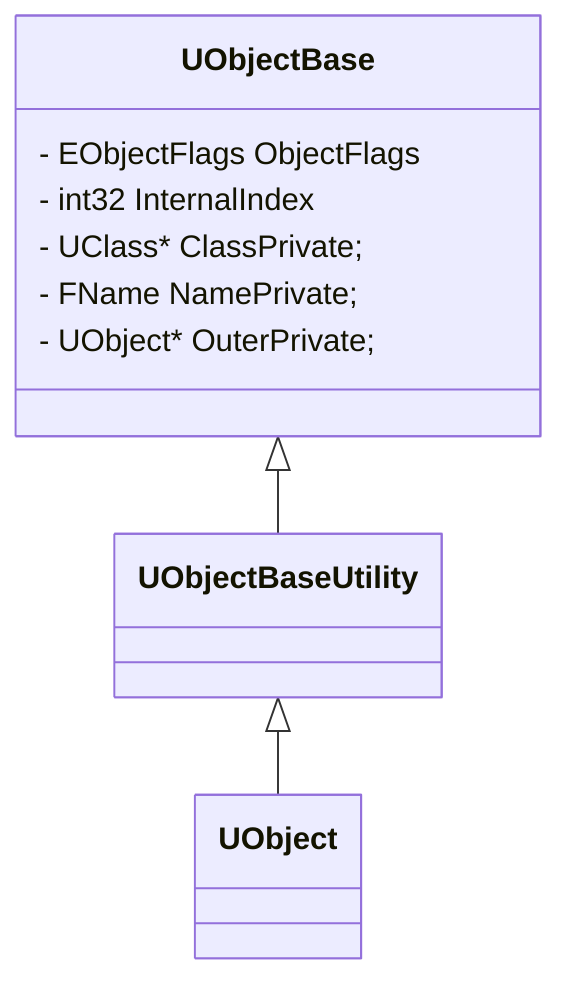
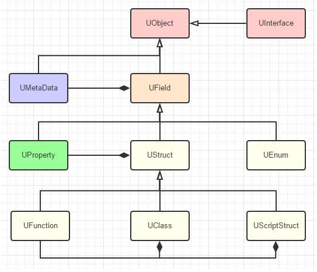

# UObject（TODO）

要描述UE4的反射机制，首先先得了解UE4中的万物之源UObject

```c++
// .\Runtime\CoreUObject\Private\UObject\UObjectHash.cpp

FUObjectArray GUObjectArray;

class FUObjectHashTables
{
    ...
public:
    static FUObjectHashTables& Get()
	{
		static FUObjectHashTables Singleton;
		return Singleton;
	}
    ...
}

// .\Runtime\CoreUObject\Private\UObject\UObjectBase.cpp
UObjectBase::UObjectBase(...)
{
    AddObject(...);
}

void UObjectBase::AddObject(...)
{
    ...
    GUObjectArray.AllocateUObjectIndex(this);
    ...
    HashObject(this);
    ...
}
```

+ `FUObjectArray FUObjectArray`  是一个全局指针数组，存储了所有使用 `NewObject` 创建的对象
+ `FUObjectHashTables` 记录了对象间的各种关系，在 GC 销毁对象时，会释放 `FUObjectArray` 中的内存和 `FUObjectHashTables` 的对象关系


> 语法解释：`<|--` 表示继承，`+` 表示 `public`，`-` 表示 `private`



```c++

class COREUOBJECT_API UObjectBase
{
    ...

private:
    /** Flags used to track and report various object states. This needs to be 8 byte aligned on 32-bit
	    platforms to reduce memory waste */
	EObjectFlags					ObjectFlags;

	/** Index into GObjectArray...very private. */
	int32							InternalIndex;

	/** Class the object belongs to. */
	UClass*							ClassPrivate;

	/** Name of this object */
	FName							NamePrivate;

	/** Object this object resides in. */
	UObject*						OuterPrivate;
    
    ...
}

// .\Runtime\CoreUObject\Public\UObject\UObjectBaseUtility.h
class COREUOBJECT_API UObjectBaseUtility : public UObjectBase
{
    ...
}

// .\Runtime\CoreUObject\Public\UObject\Object.h
class COREUOBJECT_API UObject : public UObjectBaseUtility
{
    ...
}
```

### 使用

```c++
UCLASS()
class Project_API UMyClass : public UObject
{
    GENERATED_BODY()
public:
	UFUNCTION(BluprintCallable)
	void MyFunc();
private:
	UPROPERTY(EditAnywhere, BlueprintReadWrite, meta=(AllowPrivateAccess = "true"))
	int MyIntValue;
}
```



>1. UObject
>2. UField
>3. UStruct
>4. UProperty
>5. UEnum
>6. UClass
>7. UFunction
>8. UScriptStruct