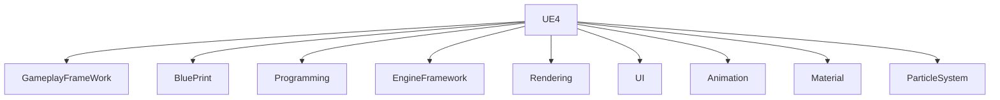
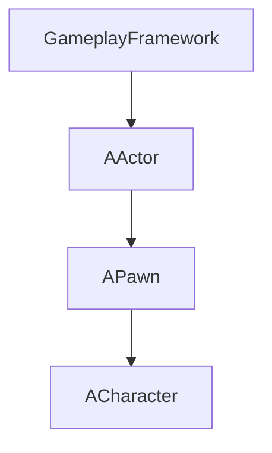

# UE4功能结构

## GameplayFramework

Gameplay框架（GameInstance->Actor\Component，3C），蓝图，资源（.uasset常用内容介绍、管理），动画，UI（UMG，Slate）

编程（类型系统，Collection、插件、工程结构）

渲染（材质、管线、地形、植被）

物理，粒子系统，GAS，AI（BT、Perception、EQS、NavMesh），网络同步

Gameplay框架（熊博文、陆荣志）；蓝图（刘开林、江士雄）；资源（Leo）；动画（湛力建、陆荣志）；UI（周于超）；类型系统（郑运辉、熊博文）

