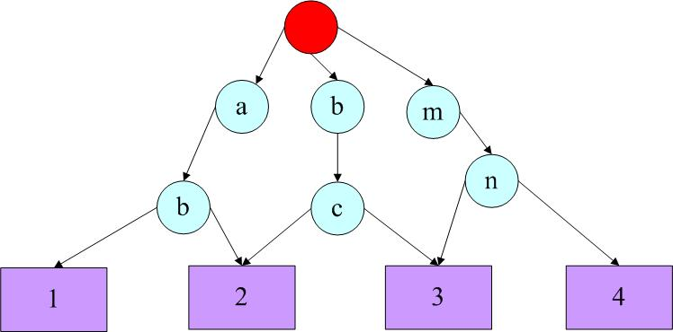

# TeraSort
###### 参考：<http://dongxicheng.org/mapreduce/hadoop-terasort-analyse/>
## 算法思想
+ 在map阶段，每个map task都会将数据分成R块（R是reduce task个数），第i块的数据会比第i+1块的数据大
+ 在reduce阶段，第i个reduce task处理所有map task中的第i块数据，最后将reduce task的结果输出

### 难点
+ 如何确定每个map task块的数据范围
+ 对于某一条数据，如何确定它属于哪一个数据块

解决方法：【采样】和【trie树】

## Terasort算法
### 流程
采样 -> map task对于数据记录做标记 -> reduce task进行局部排序
#### 采样
在JobClient端进行，抽取一部分数据，对数据进行排序，分成R个数据块，找出每个数据块的上限和下限（“分割点”），将分割点保存在分布式缓存中
#### map task对数据做标记
map阶段，每个map task从分布式缓存中读取分割点，并对这些分割点建立trie树，然后进行数据处理，对于每条数据，在trie树中查找属于他的reduce task编号，保存
#### reduce task进行局部排序
reduce task从每个map task中读取相应数据并进行排序，最后按照reduce task的编号将结果输出就行

### 关键问题
#### 采样  
+ Hadoop提供了许多采样工具：见org.apache.hadoop.mapred.lib  
+ 采样数据条数：sampleSize = conf.getLong(“terasort.partitions.sample”, 100000);
+ 选取的split个数：samples = Math.min(10, splits.length); splits是所有split组成的数组
+ 每个split提取的数据条数：recordsPerSample = sampleSize / samples;
###### 举个例子
+ 采样数据为`b，abc，abd，bcd，abcd，efg，hii，afd，rrr，mnk `
+ 排序后，得到：`abc，abcd，abd，afd，b，bcd，efg，hii，mnk，rrr`
+ 如果reduce task个数为4，则分割点为：`abd`，`bcd`，`mnk`  

#### map task对数据做标记
建立trie树（比如2-trie，即指利用前面两个字节），如下

