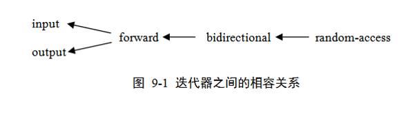

# 泛型 Generic Programming  
## 类属函数  
### C++提供了两种实现类属函数的机制
+ 采用同用指针(void *)类型的参数(C语言的做法)
```
    void sort(void *base,unsigned int count,unsigned int element_size,int(*cmp)(const void *,const void *)){

        //取第i个元素
        (char *)base+i*element_size;

        //比较i,j大小
        (*cmp)((char *)base+i*element_size,(char *)base+j*element_size);

        //交换i,j
        char *p1=(char *)base+i*element_size;
        char *p2=(char *)base+j*element_size;
        for(int k=0;k<element_size;k++){
            char temp=p1[k];
            p1[k]=p2[k];
            p2[k]=temp;
        }

    }
用byte代替char更好，强调以字节为单位：typedef unsigned char byteA *

    int A_compare(const void *p1,const void *p2){
        if( *(A *)p1 < *(A *)p2 )   return -1;
        else if( *(A *)p1 > *(A *)p2 )  return 1;
        else return 0;
    }

    A a[300];
    sort(a,300,sizeof(A),A_compare);
```
+ 函数模板：带有类型参数的函数定义
```
template <class T1,class T2,...>{...}

template <class T>
T max(T a,T b){
    return a>b?a:b;
}
```
上面sort函数的类属函数实现
```
template<class T>
void sort(T elements[],unsigned int count){
    
    //取第i个元素
    elements[i];

    //比较大小
    elements[i] < elements[j];

    //交换i,j
    T temp=elements[i];
    elements[i]=elements[j];
    elements[j]=temp;
}
```
### 性质
有时需要显式地实例化函数模板
```
template <class T>
T max(T a,T b){ return a>b?a:b;}

int x;
double z;
max(x,z);

上述max改调用什么实例化函数呢?
```
#####  solution:
+ 显式类型转换
    * max((double)x,m)
    * max(x,(int)m)
+ 显示实例化
    * max<double>(x,m)
    * max<int>(x,m)
+ 再定义一个max重载函数
`doueble max(int a,double b){return a>b?a:b;}`
  
除了类型参数外，模板函数也可以带有非类型的参数，使用时必须显式实例化
```
template<class T,int size>
void f(T a){
    T temp[size];
    ...
}
f<int,10>(1);   //调用f(1),size==10
```
## 类模板
```
template<class T>
class Stack
{
    T buffer[100];
    int top;
public:
    Stack(){ top=-1; }
    bool push(const T &x);
    bool pop(T &x);
}
template <class T>
bool Stack <T>::push(const T &x){ ... }

template <class T>
bool Stack <T>::pop(T &x){ ... }
```
### 格式
```
template <class T1,class T2,...> { ... }
```
### 性质
+ 类模板的实例化必须显式指出
```
Stack<int> st1;
int x;
st1.push(10);
st1.pop(x);
```
+ 不同的模板之间不共享模板类中的static成员
```
template <class T>
class A
{
    static int x;
    T y;
    ...
}
template <class T> 
int A<T>::x=0;

A<int> a1,a2;
A<double> d1,d2;
//a1,a2共享一个x; d1,d2共享一个x;
```
+ 类模板中也可以带非类型参数
```
template <class T,int size>
class Stack
{
    T buffer[size];
    int top;
public:
    Stack(){ top=-1; }
    bool push(const T &x);
    bool pop(T &x)
}
template <class T,int size>
bool Stack<T,size>::push(const T &x){ ... }
template <class T,int size>
bool Stack<T,size>::pop(T &x){ ... }

Stack<int,100> st1;//
```
### 模板的复用
+ 为了避免实例化问题，通常做法是把模板的定义和实现都放在头文件中
+ 使用者通过包含这个头文件，把模板的源代码全包含进来，以备实例化所需 
+ 模板是基于源代码的复用，重复实例在link中被抛弃

## STL  
+ 容器类模板：存储序列化数据元素
+ 算法模板：对容器中的元素进行常用操作
+ 迭代器模板：抽象的指针功能，用于指向容器中的元素

### 容器  
容器是由长度可变的同类型元素所构成的序列

#### STL的主要容器
+ vector
+ list
+ deque
    * 用于主要在元素序列的两端增加/删除元素以及需要快速定位（访问）任意位置上的元素的场合。
+ stack
+ queue
+ priority_queue
    * 基于vector和heap结构来实现
+ map/multimap
    * 对于map，不同元素的关键字不能相同
    * 对于multimap，不同元素的关键字可以相同
+ set/multiset
+ basic_string
    * string : `basic_string<char>`
    * wstring: `basic_string<wchar_t`

### 迭代器  
+ 输入/输出迭代器
    * 输入迭代器 OutIt
        - 用于修改它所指向的容器元素
        - 间接访问操作（*）：*<输出迭代器> = ...
        - ++操作
    * 输出迭代器 InIt
        - 用于读取它所指向的容器元素
        - 间接访问操作（*）：... = *<输入迭代器>
        - 元素成员间接访问（->）
        - ++、==、!=操作
+ 前向迭代器 FwdIt
    * 用于读取和修改它所指向的容器元素
    * 元素间接访问操作（*）和元素成员间接访问操作（->）
    * ++、==、!=操作
+ 双向迭代器 BidIt
    * 用于读取/修改它所指向的容器元素
    * 元素间接访问操作（*）和元素成员间接访问操作（->）
    * ++、--、==、!=操作
+ 随机访问迭代器 RanIt
    * 用于读取/修改它所指向的容器元素
    * 元素间接访问操作（*）、元素成员间接访问操作（->）和随机访问元素操作（[]）
    * ++、--、+、-、+=、-=、==、!=、<、>、<=、>=操作

#### 迭代器的相容关系
在需要箭头左边迭代器的地方可以用箭头右边的迭代器去替代


### 算法  

