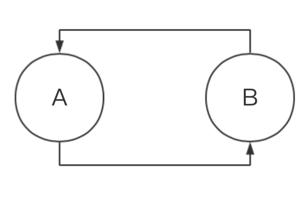
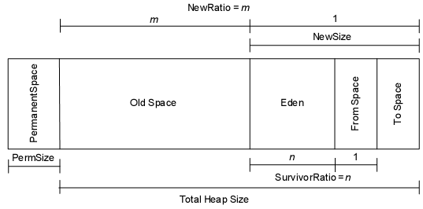

# Java 垃圾回收机制 
[Java垃圾回收（GC）机制详解]: https://www.cnblogs.com/xiaoxi/p/6486852.html

## 哪些内存需要回收
### 引用计数法
+ 给每个对象添加一个引用计数器counter
+ 当有地方引用这个对象时:counter++，引用失效的时候,counter--
+ 当counter == 0 ，失效

#### _存在的问题_ 
难以解决两个对象相互引用的问题

 

---

### 可达性分析法
+ 以一个叫做 _"GC Roots"_ 的对象作为起点
+ 通过该点向下搜索，走过的路叫做引用链
+ 如果一个对象没有引用链，失效

#### 如何选择 _GC Roots_ 呢？
在Java中，四种对象可以作为 _GC Roots_

+ 虚拟机栈（栈中的局部变量区）中引用的对象
+ 方法区中类静态属性引用的对象
+ 方法区中常量引用的对象
+ 本地方法栈中JNI引用的对象

#### 例子
  

obj8、obj9、obj10都需要回收

## 该怎么回收：垃圾收集算法
### 标记-清除算法
  

分为“标记”和“清除”两个阶段；

+ 标记出所有需要回收的对象
+ 清楚所有被标记的对象

#### _存在的问题_ 
+ 效率：标记和清楚两个过程的效率都不高
+ 空间：会产生大量的内存碎片

---

### 复制算法

+ 把内存分成两块，每次只用其中一块
+ 当一块内存用完后，将活着的对象复制到另一块上，一次清理掉用过的内存

#### _存在的问题_ 
+ 内存腰斩！只剩下一半了！因此需要调整内存分割的比例
+ 如果存活率高，那需要进行大量复制操作

---

### 标记-整理算法
  

将所有存活的对象向一端移动，直接清理掉边界外的内存

---

### 分代收集算法
 

+ 根据对象的生命周期将内存划分为几块，每块用不同的收集算法
+ 新生代使用 __复制算法__ 
+ 老年代使用 __标记-清理__ 算法或者 __标记-整理__ 算法

