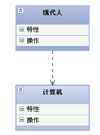

# UML

[UML类图几种关系的总结]: http://www.uml.org.cn/oobject/201609062.asp
[浅谈UML的概念和模型之UML视图]: https://blog.csdn.net/jiuqiyuliang/article/details/8550281
[浅谈UML的概念和模型之UML九种图]: https://blog.csdn.net/jiuqiyuliang/article/details/8552956

 Unified Modeling Language，统一建模语言

## 常见关系

+ 泛化  Generalization
+ 实现  Realization
+ 关联  Association
+ 聚合  Aggregation
+ 组合  Composition
+ 依赖  Dependency

#### 泛化：继承 extend

是一种继承关系，上图中的**SUV**指向**小汽车**（SUV是一种汽车），再比如

#### 实现：implement

类与接口之间的关系，上图中**小汽车**和**自行车**都是**车**的具体实现，再比如

#### 关联：成员变量

拥有关系，一个类可以知道另一个类的信息（属性和方法），箭头从**拥有者**指向**被拥有者**

#### 聚合：成员变量

整体和部分的关系，**轮胎**和**发动机**是**汽车**的一部分

#### 组合：成员变量

整体和部分的关系，学生与班级之间的关系，与聚合不同的是：

+ 聚合的个体可以单独存在，也就是说没了**汽车**，**轮胎**也可以独立存在
+ 组合则保证了部分是依赖于整体的存在而存在的，没有了**公司**就没有**部门**

#### 依赖：局部变量，静态变量，参数

一种使用关系，一个类的实现需要其他类的支持

### 练习

## UML图的视图

## UML的九种图

#### 用例图

【概念】描述用户需求，从用户角度描述系统的功能

【描述方式】椭圆表示某个用例；人形符号表示角色

【目的】帮助开发团队以一种可视化的方式理解系统的功能需求

#### 类图

【概念】显示系统的静态结构，表示不同的实体如何相关联

【描述方式】三个矩形

【目的】表示一个逻辑类或实现类

+ 逻辑类通常是用户的业务所设计的事务
+ 实现类是程序员处理的实体

#### 对象图

【概念】描述系统在具体时间点上所包含的对象以及各个对象的关系

  

#### 序列图

【概念】描述对象之间的交互顺序，着重体现对象间消息传递的时间顺序

【描述方式】横跨图的顶部，每个框表示每个类的实例或对象；类实例名称和类名称使用冒号分开

【目的】显示流程中不同对象之间的调用关系，还可以显示不同对象的不同调用。

  

#### 协作图

【概念】描述对象之间的合作关系，侧重对象之间的消息传递 

#### 状态图

【概念】描述对象之间的交互顺序，着重体现对象间消息传递的时间顺序

【描述方式】

1. 起始点：实心圆
2. 状态间的转换：开箭头线段
3. 状态：圆角矩阵
4. 判断点：空心圆
5. 一个或多个终止点：内部包含实心圆的圆

【目的】表示某个类所处的不同状态以及该类在这些状态中的转换过程

#### 活动图

【概念】描述满足用例要求所要进行的活动以及活动时间的约束关系

【描述方式】  

1. 起始点：实心圆 
2. 活动：圆角矩形 
3. 终止点：内部包含实心圆的圆 
4. 泳道：实际执行活动的对象

【目的】表示两个或多个对象之间在处理某个活动时的过程控制流程

#### 构建图

【概念】描述代码构件的物理结构以及各构件之间的依赖关系

【描述方式】构件

【目的】提供系统的物理视图，根据系统的代码构件显示系统代码的整个物理结构

 

#### 部属图

【概念】系统中硬件的物理体系结构

【描述方式】  

1. 三维立方体表示部件 
2. 节点名称位于立方体上部

【目的】显示系统的硬件和软件的物理结构

