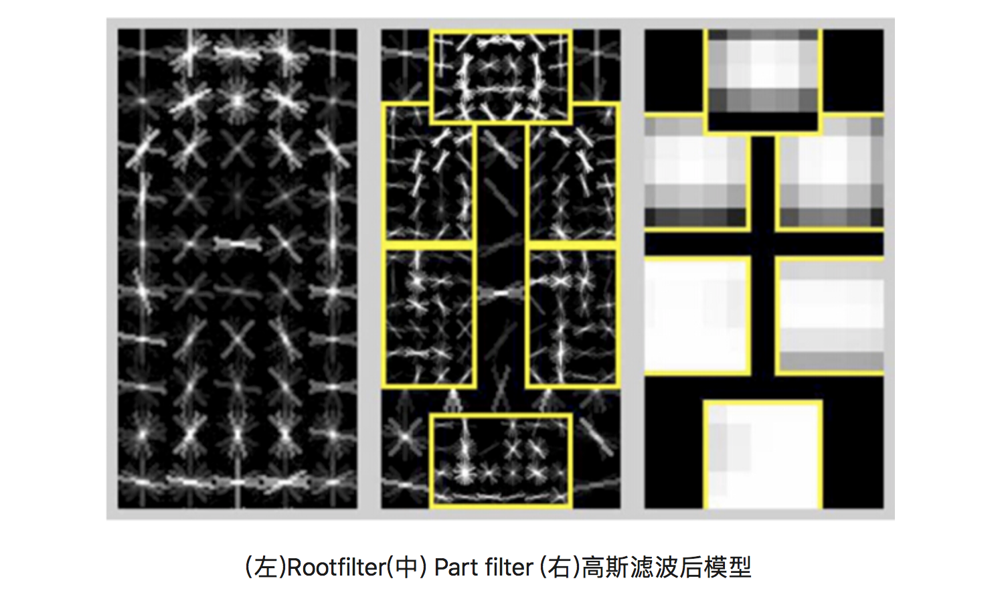
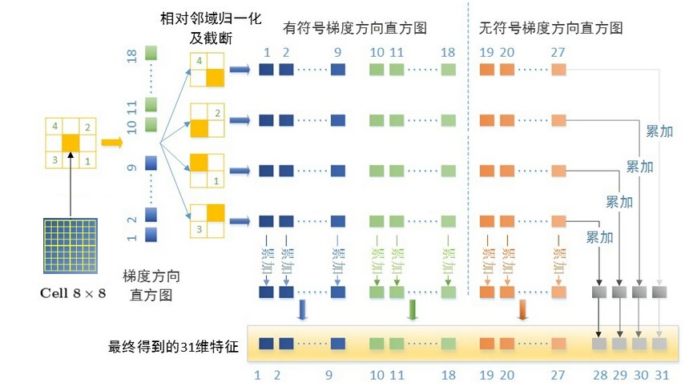
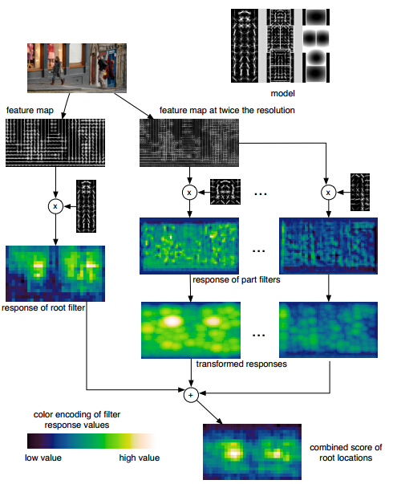
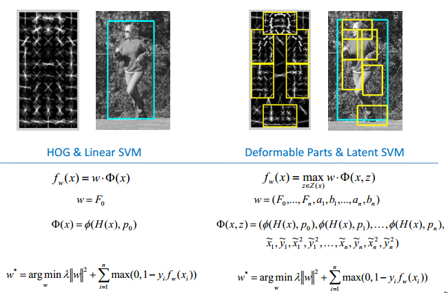
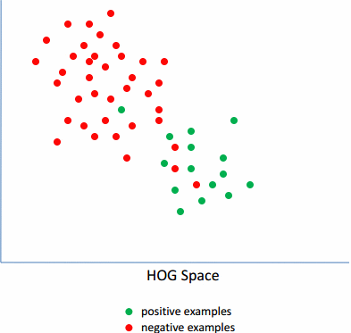
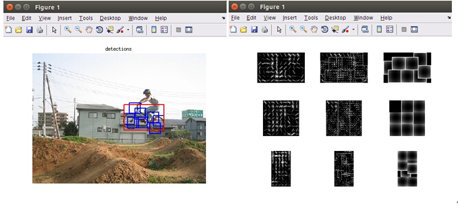

# DPM[^1]

[1]: https://blog.csdn.net/qq_22625309/article/details/72493223	"DPM（Deformable Parts Models）-----目标检测算法理解"
[2]: https://blog.csdn.net/qq_14845119/article/details/52625426	"DPM（Deformable Part Model）原理详解"

DPM是一种基于组件的检测算法，如果不熟悉HOG可以先看一下[HOG](HOG.md)

## 算法思想

输入一副图像，对图像提取图像特征，针对某个物件制作出相应的激励模版，在原始的图像滑动计算，得到该激励效果图，根据激励的分布，确定目标的位置。

制作激励模板就相当于人为地设计一个卷积核，一个比较复杂的卷积核，拿这个卷积核与原图像进行卷积运算得到一幅特征图。比如拿一个静止站立的人的HOG特征形成的卷积核，与原图像的梯度图像进行一个卷积运算，那么目标区域就会被加密。

那么说到这里就会出现一个问题，人在图像中可能有各种的姿态，比如躺着，趴着，坐着等等，我们只用一个静止站立状态的人的激励模板去做探测就会失败。也就是说图像中的物件可能会发生形变，那么我们用固定的激励模板去探测目标物件的时候就不再适用，那么该如何解决这一问题呢，这就引出了局部模板，也就是说，我们不做一个整体的人的激励模板，转而去做人的部分组件的模板，比如头、胳膊、腿等，其实这就是DPM算法。

## 算法的步骤

1. 产生多个模版，整体模版以及不同的局部模版
2. 利用这些模版对输入图像进行卷积得到特征图
3. 将这些特征图组合成特征
4. 对特征进行传统分类，回归得到目标位置

### Root filter + Part fileter

模型中包含一个8\*8的 *root filter* 和 4\*4的 *part filter* 

### 响应值score的计算

+ $score(x_0,y_0,l_0)=R_{0,l_0}(x_0,y_0)+\sum \limits^n_{i=1}D_{i,l_0-\lambda}(2(x_0,y_0)+v_i)+b$
  + $x_0,y_0,l_0$：锚点的横坐标，纵坐标，尺度
  + $R_{0,l_0}(x_0,y_0)$：根模型的响应分数
  + $D_{i,l_0-\lambda}(2(x_0,y_0)+v_i)$：部件模型的响应分数
  + $b$：不同模型组件之间的偏移系数，加上这个偏移量使其与模型对齐

+ $D_{i,l}(x,y)=\max \limits_{dx,dy}(R_{i,l}(x+dx,y+dy)-d_i·\phi_d(dx,dy))$
  + $x,y$：训练的理想模型的位置
  + $R_{i,l}(x+dx,y+dy)$：组件模型的匹配得分
  + $d_i·\phi_d(dx,dy))$：组件的偏移损失得分
    + $d_i$：偏移损失系数
    + $\phi_d(dx,dy))$：组件模型的锚点和组建模型的检测点之间的距离

简单的说，这个公式表明，组件模型的响应越高，各个组件和其相应的锚点距离越小，则响应分数越高，越有可能是待检测的物体。

### 特征定义

### DPM检测流程

如上图所示，对于任意一张输入图像，提取其DPM特征图，然后将原始图像进行高斯金字塔[^2]上采样，然后提取其DPM特征图。对于原始图像的DPM特征图和训练好的Root filter做卷积操作，从而得到Root filter的响应图。对于2倍图像的DPM特征图，和训练好的Part filter做卷积操作，从而得到Part filter的响应图。然后对其精细高斯金字塔的下采样操作。这样Root filter的响应图和Part filter的响应图就具有相同的分辨率了。然后将其进行加权平均，得到最终的响应图。亮度越大表示响应值越大。

### Latent SVM

由于，训练的样本中，负样本集肯定是100%的准确的，而正样本集中就可能有噪声。因为，正样本的标注是人工进行的，人是会犯错的，标注的也肯定会有不精确的。因此，需要首先去除里面的噪声数据。而对于剩下的数据，里面由于各种角度，姿势的不一样，导致训练的模型的梯度图也比较发散，无规则。因此需要选择其中的具有相同的姿势的数据，即离正负样本的分界线最近的那些样本，将离分界线很近的样本称为Hard-examples，相反，那些距离较远的称为Easy-examples。

#### 实际效果

## 优点

1. 方法直观简单
2. 运行速度快
3. 适应动物变形

## 缺点

1. 性能一般
2. 激励特征认为设计，工作量大，不具有普适性
3. 无法大幅度的旋转，稳定性差

## 实验效果

如下图所示，左面为检测自行车的检测效果，右面为Root filter，Part filter，2维高斯滤波下的偏离损失图

---

##### 脚注

[^1]: Deformable Part Model 可变形组件模型
[^2]: 高斯金字塔：[参考文章](https://blog.csdn.net/dcrmg/article/details/52561656)