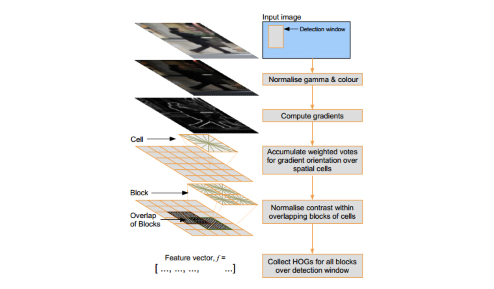
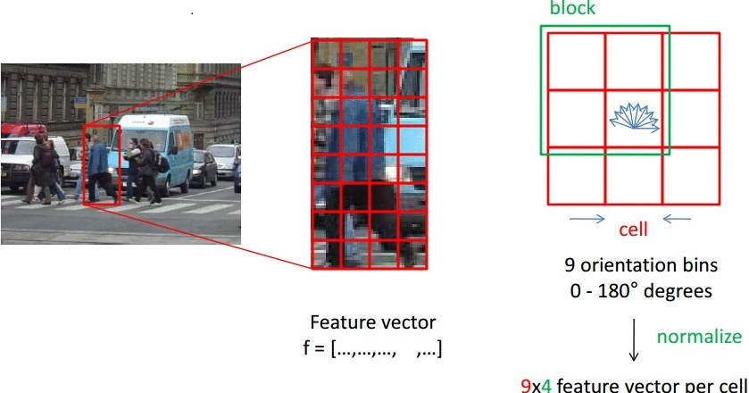
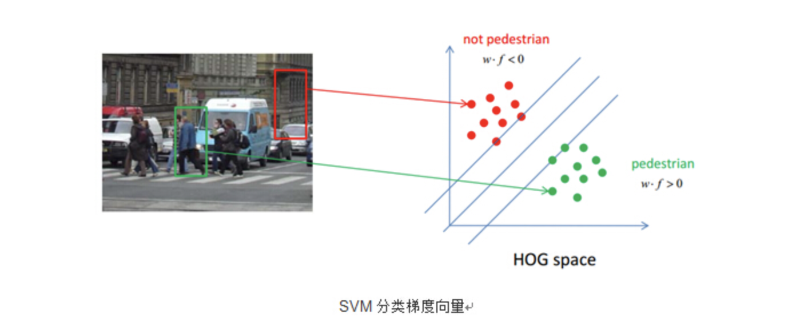

# HOG[^1] 

[1]: https://blog.csdn.net/qq_14845119/article/details/52187774	"行人检测之HOG——方向梯度直方图(Histogram of Oriented Gradient）"

梯度方向直方图(HOG)是一种能对物体进行检测的基于形状边缘特征的描述算子，它的基本思想是利用梯度信息能很好的反映图像目标的边缘信息并通过局部梯度的大小将图像局部的外观和形状特征化

## 算法思想

### 算法流程

### 颜色空间归一化

在现实的情况，图像目标会出现在不同的环境中，光照也会有所不一样，颜色空间归一化就是对整幅图像的颜色信息作归一化处理从而减少不同光照及背景的影响，也为了提高检测的鲁棒性，引入图像的Gamma归一化[^2]和颜色空间归一化[^3]来作为特征提取的预处理手段。不能对图像进行高斯平滑处理，因平滑处理会降低图像目标边缘信息的辨识度，影响检测结果。

### 梯度计算

利用差分模版直接计算梯度，和数字图像处理中的相同

### 计算cell的梯度直方图

将整个目标窗口分成互不重叠大小相等的cell，然后分别计算出每个cell的梯度信息，包括梯度大小和梯度方向[^4]。将像素的梯度方向分成9个bins。每个cell内的像素给所在的梯度方向直方图进行加权投票。

### 对组合成块的梯度直方图归一化

从梯度的计算方式可以看出，梯度的绝对值大小容易受到前景与背景对比度以及局部光照的影响，要减少这种影响得到较准确的检测效果就必须对局部cell进行归一化处理。

将几个cell组合成更大的block，这时整幅图像可以看成是检测窗口，将block看成滑动窗口，依次从左到右、从上到下进行滑动，得到一些有重复cell的block，再对这些block信息分别做归一化处理。

### 对归一化梯度特征进行SVM分类

如下图所示，对于滑动窗口提取的2个窗口，分别计算出归一化的梯度特征，然后应用SVM实现是人还是背景的分类判定。

---

#####  脚注

[^1]: 方向梯度直方图 Histogram of Oriented Gradient 
[^2]: Gamma归一化：$y=x^\gamma$
[^3]: 颜色归一化：可以消除光照因素的影响： $r=\frac{R}{R+G+B} \quad g=\frac{G}{R+G+B} \quad b=1-r-g$
[^4]: 梯度大小：$|\nabla f(x,y)|=mag(\nabla f(x,y))=(G^2_x+G^2_y)^{\frac{1}{2}}$，梯度方向：$\phi(x,y)=\arctan(G_y/G_x)$，其中$G_x = \frac{\partial f}{\partial x},G_y = \frac{\partial f}{\partial y}$

