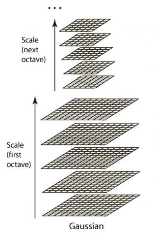

# 各种图像金字塔

## 图像金字塔

图像金字塔是一种以多分辨率来解释图像的结构。通过对原始图像进行多尺度像素采样的方式，生成N个不同分辨率的图像。把具有最高级别分辨率的图像放在底部，以金字塔形状排列，往上是一系列像素逐渐降低的图像，一直到金字塔的顶部只包含一个像素点的图像，这就构成了传统意义上的图像金字塔。

### 步骤

1. 利用低通滤波器平滑图像
2. 对平滑图像进行采样
   + 上采样[^up-sampling]：分辨率逐级升高
   + 下采样[^down-sampling]：分辨率逐级降低

## 高斯金字塔

高斯金字塔式在SIFT[^SIFT]算子中提出来的概念，首先高斯金字塔并不是一个金字塔，而是有很多组（Octave）金字塔构成，并且每组金字塔都包含若干层（Interval）。

### 步骤

1. 将原图像扩大一倍之后作为高斯金字塔第1组第1层，然后第1组第1层的图像经过高斯滤波之后作为第1组第2层
2. 将高斯函数的平滑系数$\sigma$乘一个系数$k$，得到新的平滑因子$k\sigma$，用来平滑第1组第2层的图像，结果作为第三层
3. 不断重复，最后得到L层图像，每一层的图像大小都是一样的，只是平滑系数$\sigma$不同，分别是$0,\sigma,k\sigma,k^2\sigma,\dots,k^{L-2}\sigma$
4. 然后将第1组倒数第三层图像作为比例因子为2的降采样，得到的图像作为第2组的第1层，然后对第2组的第1层图像做平滑因子为$\sigma$的高斯平滑，得到第2组的第2层，就像步骤2中一样，如此得到第2组的L层图像，同组内的图像尺寸是一样的，但是在尺寸方面第2组是第1组图像的一半。
5. 这样反复执行，就可以得到一共O组，每组L层，共计O*L个图像，这些图像一起就构成了高斯金字塔，结构如下：
   

在同一组内，不同层图像的尺寸是一样的，后一层图像的高斯平滑因子σ是前一层图像平滑因子的k倍；

在不同组内，后一组第一个图像是前一组倒数第三个图像的二分之一采样，图像大小是前一组的一半；

## 尺度空间

用来解决图像在所有尺度下描述的问题

在高斯金字塔中一共生成O组L层不同尺度的图像，这两个量合起来（O，L）就构成了高斯金字塔的尺度空间，也就是说以高斯金字塔的组O作为二维坐标系的一个坐标，不同层L作为另一个坐标，则给定的一组坐标（O,L）就可以唯一确定高斯金字塔中的一幅图像。

## DOG金字塔

差分金字塔，DOG（Difference of Gaussian）金字塔是在高斯金字塔的基础上构建起来的，其实生成高斯金字塔的目的就是为了构建DOG金字塔。

DOG金字塔的第1组第1层 = 高斯金字塔的第1组第2层 - 第1组第1层

以此类推，逐组逐层生成每一个差分图像，所有差分图像构成差分金字塔。概括为DOG金字塔的第o组第l层图像是有高斯金字塔的第o组第l+1层减第o组第l层得到的。

每一组在层数上，DOG金字塔比高斯金字塔少一层。后续Sift特征点的提取都是在DOG金字塔上进行的。

---

##### 脚注

[^up-sampling]: 放大图片，原理：采用内插值方法——在原有图像像素的基础上在像素点之间采用合适的插值算法插入新元素
[^down-sampling]: 缩小图片，原理：把原始图像一个窗口内的像素求均值作为缩小后图像的像素点值
[^SIFT]: 尺度不变特征变换 Scale-invariant feature transform，具有尺度不变性。是一种局部特征描述子

