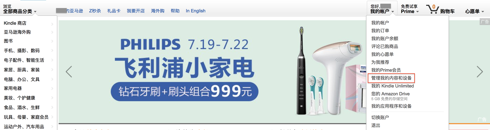
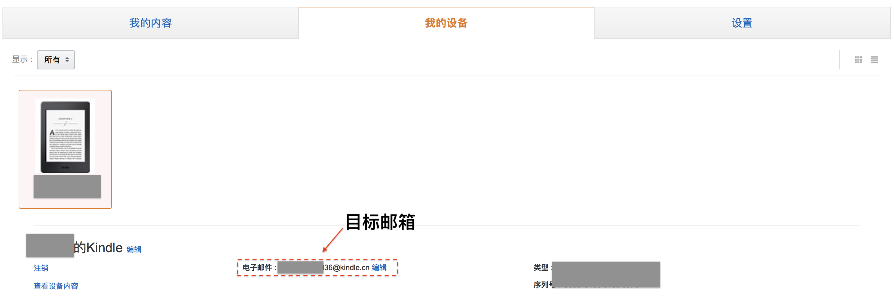
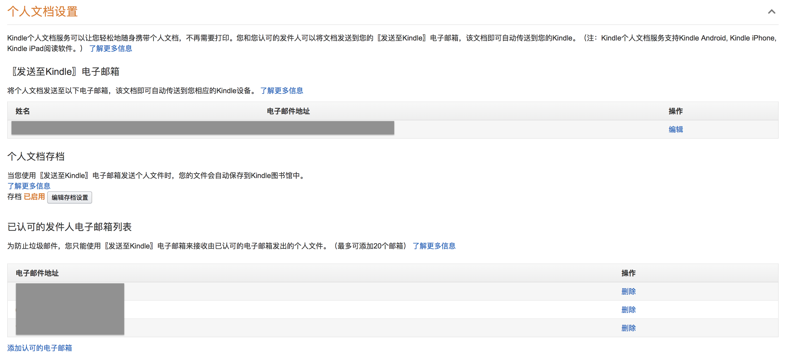

# 利用邮件给kindle推送书籍

该方法是直接利用amazon的官方功能给kindle推送自己下载的书籍，详细参考相关链接

[官方方法]: https://www.amazon.cn/gp/help/customer/display.html?nodeId=201974220	"使用您的〖发送至Kindle〗电子邮箱"

## 概述

利用邮箱向亚马逊指定邮箱发送相关消息，分为三步：

+ 设定发送邮箱为信任邮箱
+ 确定文档类型
+ 发送文件

## 具体方法

### 设定发送邮箱为信任邮箱

1. 打开亚马逊官网：https://www.amazon.cn，并点开【管理我的内容和设备】

2. 在新出现的页面中点击【我的设备】查看是否有相关设备，以及电子邮箱，这个邮箱就是我们要发送邮件的目标邮箱

3. 再点击旁边的【设置】，选择【个人文档设置】，在这里可以看到**发送至Kindle电子邮箱**，也就是上面的目标邮箱以及**已认可的发件人电子邮箱列表**，在**已认可的发件人电子邮箱列表**一栏选择【添加认可的电子邮箱】，输入相关信息即可完成添加

### 确定文档类型

具体可参考相关链接

[文档类型]: https://www.amazon.cn/gp/help/customer/display.html?nodeId=200767340	"Kindle个人文档服务"

Kindle个人文档服务支持以下文件类型： 

- Kindle格式（.MOBI、.AZW） 
- Microsoft Word（.DOC、.DOCX） 
- HTML（.HTML、.HTM） 
- RTF (.RTF) 
- Text (.TXT) (Kindle X 咪咕电子书阅读器不支持)
- JPEG（.JPEG、.JPG） 
- GIF (.GIF) 
- PNG (.PNG) 
- BMP (.BMP) 
- PDF (.PDF)

### 发送文件

打开刚刚添加的**认可的电子邮箱**，选择写信

在收件人上填写上面的**发送至Kindle电子邮箱**

+ 如果要发送的文件格式为上面的文档类型（除了.MOBI，.AZW），在主题处填写Convert，amazon系统会帮你自动转换成相应的mobi文档
+ 如果格式为.MOBI或者.AZM，主题随便填，不要填写Convert即可。

正文请随意，在附件上添加要发送的文件即可，如果发送失败，会有回信告知，否则就是发送成功

## 失败的可能原因

1. 没有添加信任——没有任何回信
2. 文件格式
3. Convert问题